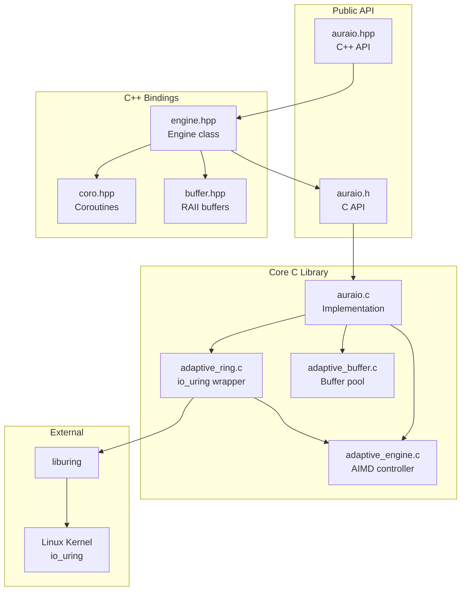
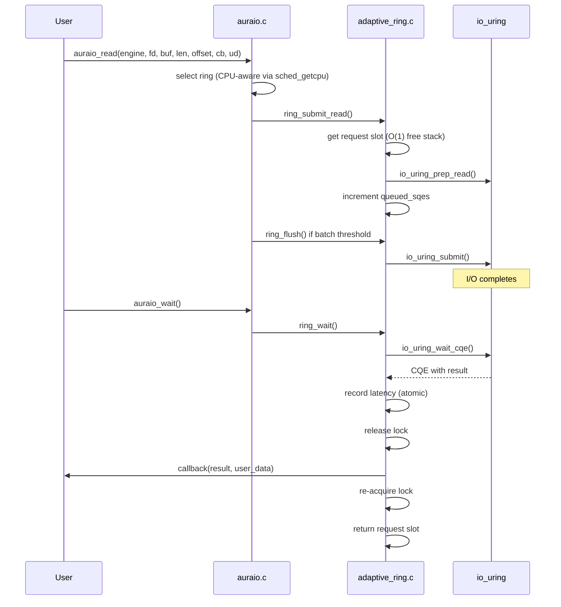
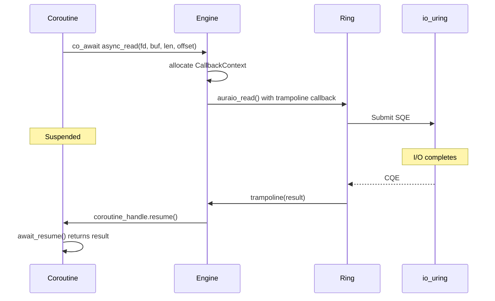
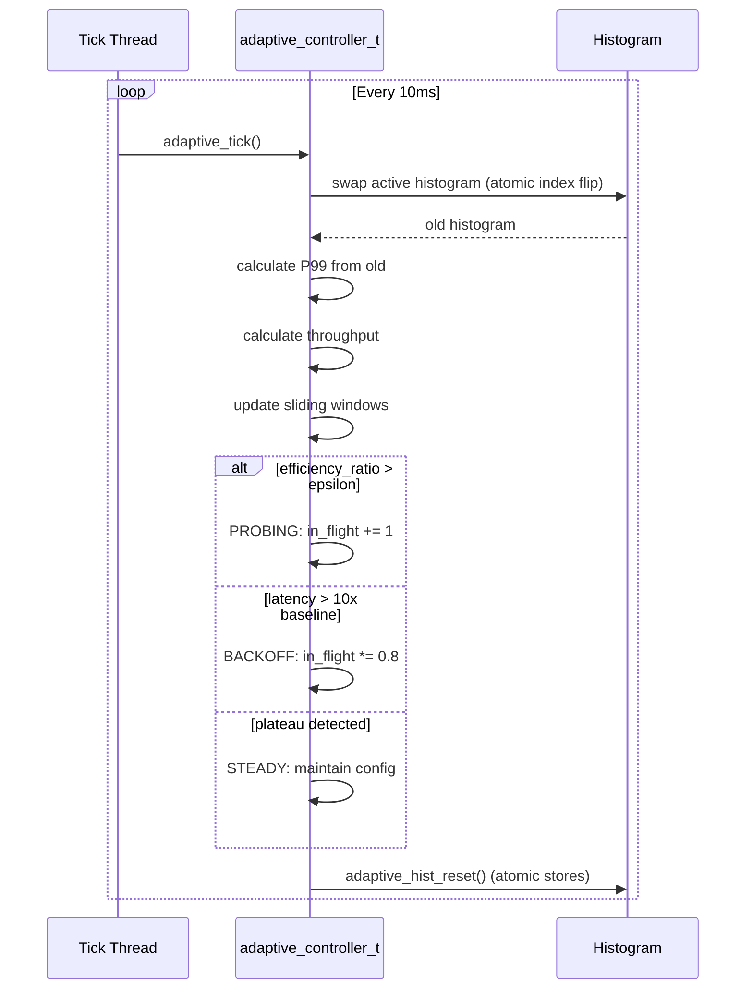

# AuraIO Codebase Map

> Auto-generated by Cartographer. Last mapped: 2026-02-05

## System Overview

AuraIO (Adaptive Uring Runtime Architecture) is a self-tuning asynchronous I/O library for Linux built on io_uring. It uses AIMD (Additive Increase Multiplicative Decrease) congestion control to automatically optimize I/O parameters for throughput and latency.



## Directory Structure

```
AuraIO/
├── include/
│   ├── auraio.h              # Public C API (opaque types, all user-facing functions)
│   ├── auraio.hpp            # C++ umbrella header
│   └── auraio/
│       ├── engine.hpp        # Engine class with callbacks
│       ├── coro.hpp          # C++20 coroutine support (Task<T>, awaitables)
│       ├── buffer.hpp        # RAII buffer wrappers
│       ├── options.hpp       # Configuration wrapper
│       ├── request.hpp       # Request wrapper
│       ├── stats.hpp         # Stats wrapper
│       ├── error.hpp         # Exception types
│       ├── fwd.hpp           # Forward declarations
│       └── detail/
│           └── callback_storage.hpp  # Type-erased callback pool
├── src/
│   ├── auraio.c              # Public API implementation, ring selection, event loop
│   ├── adaptive_ring.c       # io_uring wrapper, request pool, completion handling
│   ├── adaptive_ring.h       # Ring internal interface
│   ├── adaptive_engine.c     # AIMD algorithm, P99 tracking, phase state machine
│   ├── adaptive_engine.h     # Adaptive controller interface, tuning constants
│   ├── adaptive_buffer.c     # Thread-safe aligned buffer pool with sharding
│   ├── adaptive_buffer.h     # Buffer pool interface
│   └── internal.h            # Shared utilities (timing, iovec helpers)
├── examples/
│   ├── C/
│   │   ├── quickstart.c      # Minimal read example
│   │   ├── simple_read.c     # Single file read with stats
│   │   ├── bulk_reader.c     # High-throughput directory scanner
│   │   └── write_modes.c     # O_DIRECT vs buffered comparison
│   ├── cpp/
│   │   ├── quickstart.cpp    # Minimal C++ async read
│   │   ├── simple_read.cpp   # C++ version of simple read
│   │   ├── bulk_reader.cpp   # C++ high-throughput scanner
│   │   ├── write_modes.cpp   # C++ write modes demo
│   │   └── coroutine_copy.cpp # C++20 coroutine file copy
│   └── Makefile
├── tests/
│   ├── test_engine.c         # AIMD algorithm tests
│   ├── test_ring.c           # Ring management tests
│   ├── test_buffer.c         # Buffer pool tests
│   ├── test_cpp.cpp          # C++ binding tests
│   ├── stress_test.cpp       # Multi-threaded stress test
│   ├── bench_buffer.c        # Buffer pool microbenchmark
│   ├── repro_race.c          # Race condition reproduction
│   └── Makefile
├── pkg/
│   └── libauraio.pc.in       # pkg-config template
├── lib/                      # Build output (.so, .a, .pc)
├── Makefile                  # Main build system
└── README.md                 # User documentation
```

## Module Guide

### Public C API (`include/auraio.h` + `src/auraio.c`)

**Purpose**: User-facing C interface tying together rings, buffers, and adaptive control

**Entry point**: `include/auraio.h`

| File | Purpose | Tokens |
|------|---------|--------|
| `include/auraio.h` | Public types and function declarations | 5,483 |
| `src/auraio.c` | API implementation | 8,931 |

**Key Types**:
- `auraio_engine_t` - Opaque engine handle
- `auraio_request_t` - Opaque request handle
- `auraio_buf_t` - Unified buffer descriptor (regular or registered)
- `auraio_callback_t` - Completion callback: `void (*)(auraio_request_t*, ssize_t, void*)`
- `auraio_stats_t` - Statistics snapshot
- `auraio_options_t` - Engine configuration

**Key Functions**:
- Lifecycle: `auraio_create()`, `auraio_create_with_options()`, `auraio_destroy()`
- I/O: `auraio_read()`, `auraio_write()`, `auraio_readv()`, `auraio_writev()`, `auraio_fsync()`
- Event loop: `auraio_poll()`, `auraio_wait()`, `auraio_run()`, `auraio_stop()`
- Buffers: `auraio_buffer_alloc()`, `auraio_buffer_free()`
- Registered I/O: `auraio_register_buffers()`, `auraio_register_files()`
- Cancellation: `auraio_cancel()`

**Dependencies**: All internal modules, liburing, pthread, eventfd

**Thread Safety**: Multiple threads can submit concurrently (per-ring locks); single thread should poll

---

### C++ Bindings (`include/auraio.hpp` + `include/auraio/*.hpp`)

**Purpose**: Modern C++20 interface with RAII, exceptions, concepts, and coroutines

**Entry point**: `include/auraio.hpp`

| File | Purpose | Tokens |
|------|---------|--------|
| `include/auraio.hpp` | Umbrella header | 427 |
| `include/auraio/engine.hpp` | Engine class, callbacks, concepts | 3,869 |
| `include/auraio/coro.hpp` | Task<T>, IoAwaitable, FsyncAwaitable | 2,134 |
| `include/auraio/buffer.hpp` | Buffer (RAII), BufferRef | 1,798 |
| `include/auraio/options.hpp` | Options wrapper | 971 |
| `include/auraio/request.hpp` | Request wrapper | 439 |
| `include/auraio/stats.hpp` | Stats wrapper | 467 |
| `include/auraio/error.hpp` | auraio::Error exception | 531 |
| `include/auraio/fwd.hpp` | Forward declarations | 83 |
| `include/auraio/detail/callback_storage.hpp` | CallbackPool, type erasure | 663 |

**Key Classes**:
- `auraio::Engine` - Move-only engine wrapper with template callbacks
- `auraio::Buffer` - RAII buffer owner (returns to pool on destruction)
- `auraio::BufferRef` - Lightweight buffer descriptor (no ownership)
- `auraio::Request` - Request wrapper
- `auraio::Error` - Exception with errno

**Coroutine Support** (C++20):
- `Task<T>` - Lazy coroutine returning T
- `IoAwaitable` - Awaitable for read/write (yields `ssize_t`)
- `FsyncAwaitable` - Awaitable for fsync (yields `void`)

**Example**:
```cpp
Task<int> read_file(Engine& engine, int fd) {
    auto buf = engine.allocate_buffer(4096);
    ssize_t n = co_await engine.async_read(fd, buf, 4096, 0);
    co_return n;
}
```

**Patterns**:
- Type-erased callbacks via `std::function` + trampoline
- Pre-allocated `CallbackPool` avoids per-I/O malloc
- Move-only semantics prevent accidental copies

---

### Ring Manager (`src/adaptive_ring.c/.h`)

**Purpose**: io_uring wrapper with request tracking, batching, and per-ring adaptive control

**Entry point**: `src/adaptive_ring.h`

| File | Purpose | Tokens |
|------|---------|--------|
| `src/adaptive_ring.h` | Ring interface, request struct | 2,006 |
| `src/adaptive_ring.c` | Ring implementation | 4,416 |

**Key Types**:
- `ring_ctx_t` - Per-ring context (io_uring, request pool, mutex, adaptive controller)
- `auraio_request_t` - Request with callback, timing, cancellation state

**Key Functions**:
- `ring_init()`, `ring_destroy()` - Lifecycle
- `ring_submit_read()`, `ring_submit_write()`, `ring_submit_fsync()` - Submission
- `ring_submit_read_fixed()`, `ring_submit_write_fixed()` - Registered buffer I/O
- `ring_poll()`, `ring_wait()` - Completion processing
- `ring_get_request()`, `ring_put_request()` - O(1) request pool

**Patterns**:
- Free stack for O(1) request allocation
- Lock released during callback to allow re-entrant submission
- SQPOLL with graceful fallback to normal mode
- `process_completion()` manages its own locking internally

**Gotchas**:
- Request handle only valid until callback begins
- Callers must NOT hold lock when calling `process_completion()`
- Callbacks can submit new I/O (re-entry safe)

---

### Adaptive Engine (`src/adaptive_engine.c/.h`)

**Purpose**: AIMD congestion control for automatic I/O tuning

**Entry point**: `src/adaptive_engine.h`

| File | Purpose | Tokens |
|------|---------|--------|
| `src/adaptive_engine.h` | Controller interface, constants | 3,091 |
| `src/adaptive_engine.c` | AIMD implementation | 3,860 |

**Key Types**:
- `adaptive_controller_t` - Per-ring controller state
- `adaptive_phase_t` - State machine phases
- `adaptive_histogram_t` - P99 latency tracking (50μs buckets, 200 buckets)

**Key Functions**:
- `adaptive_init()`, `adaptive_destroy()` - Lifecycle
- `adaptive_tick()` - Called every 10ms, runs AIMD algorithm
- `adaptive_record_completion()` - Record latency sample (lock-free atomic)
- `adaptive_get_inflight_limit()`, `adaptive_get_batch_threshold()` - Current tuned values

**AIMD State Machine**:
```
BASELINE (warmup, 100ms)
    ↓
PROBING (additive increase: +1/tick)
    ↓ plateau OR latency spike
BACKOFF (multiplicative decrease: ×0.8)
    ↓
SETTLING (wait 100ms)
    ↓
STEADY (maintain config)
    ↓ stable for 5s
CONVERGED (no more changes)
```

**Dual-Loop Control**:
1. **Outer Loop (AIMD)**: Adjusts in-flight limit based on efficiency ratio
2. **Inner Loop (Batch Optimizer)**: Adjusts batch threshold targeting 8 SQEs/syscall

**Key Constants** (tuned for NVMe SSDs):
```c
ADAPTIVE_SAMPLE_INTERVAL_MS    = 10     // Tick every 10ms
ADAPTIVE_WARMUP_SAMPLES        = 10     // 100ms baseline
ADAPTIVE_AIMD_INCREASE         = 1      // Add 1 per tick
ADAPTIVE_AIMD_DECREASE         = 0.80   // Cut 20% on backoff
ADAPTIVE_LATENCY_GUARD_MULT    = 10.0   // Backoff if P99 > 10x baseline
ADAPTIVE_DEFAULT_LATENCY_GUARD = 10.0   // Hard ceiling: 10ms P99
```

**Patterns**:
- Double-buffered histogram for O(1) swap/reset
- Efficiency ratio: Δthroughput / Δin_flight
- Low-IOPS handling: Extends sample window when < 20 samples

**Gotchas**:
- Histogram swap uses `adaptive_hist_reset()` with atomic stores (not memset)
- P99 requires minimum 20 samples for validity

---

### Buffer Pool (`src/adaptive_buffer.c/.h`)

**Purpose**: Thread-safe 4KB-aligned buffer pool with size-class buckets

**Entry point**: `src/adaptive_buffer.h`

| File | Purpose | Tokens |
|------|---------|--------|
| `src/adaptive_buffer.h` | Pool interface | 1,213 |
| `src/adaptive_buffer.c` | Pool implementation | 4,563 |

**Key Types**:
- `buffer_pool_t` - Main pool (shards, thread cache registry)
- `buffer_shard_t` - Per-shard state (mutex, free lists by size class)
- `thread_cache_t` - TLS cache for lock-free fast path

**Key Functions**:
- `buffer_pool_init()`, `buffer_pool_destroy()` - Lifecycle
- `buffer_pool_alloc()`, `buffer_pool_free()` - Allocate/free aligned buffers

**Three-Tier Architecture**:
```
Thread Cache (TLS, no lock, ~10ns)
    ↓ cache miss
Shard (per-shard lock, ~50ns)
    ↓ shard empty
posix_memalign (slow path)
```

**Size Classes**: 16 classes from 4KB to 128MB (power-of-2)

**Auto-Scaling Shards**:
```
4 cores   → 2 shards   (~2 threads/shard)
16 cores  → 4 shards   (~4 threads/shard)
64 cores  → 16 shards  (~4 threads/shard)
500 cores → 64 shards  (~8 threads/shard)
```

**Patterns**:
- Uses `__builtin_clzl()` for O(1) size-to-class mapping
- Batch transfers (4 at a time) between cache and shard
- High-water mark limits cached buffers (default 64/shard)

**Gotchas**:
- Only first pool per thread gets TLS cache benefit
- Pre-allocated metadata eliminates malloc on free path
- `destroyed` flag checked to prevent use-after-free

---

### Internal Utilities (`src/internal.h`)

**Purpose**: Shared utilities across modules

| File | Purpose | Tokens |
|------|---------|--------|
| `src/internal.h` | Timing, iovec helpers | 314 |

**Exports**:
- `get_time_ns()` - Monotonic nanosecond clock (CLOCK_MONOTONIC)
- `iovec_total_len()` - Safe vectored I/O size with overflow check

---

## Data Flow

### Read Operation



### C++ Coroutine Flow



### Adaptive Tuning Flow



## Thread Safety

| Component | Mechanism | Notes |
|-----------|-----------|-------|
| Ring submission | `pthread_mutex_t` per ring | Released during callback |
| Request state | Atomics (`pending`, `cancel_requested`) | Lock-free checks |
| Histogram recording | Atomic increments | No lock needed |
| Histogram swap | Atomic index flip | O(1) operation |
| Buffer TLS cache | Thread-local storage | Zero lock fast path |
| Buffer shards | Per-shard mutex | Round-robin selection |
| Engine stats | Atomics with release/acquire | ARM/PowerPC safe |
| C++ CallbackPool | Mutex-protected allocation | Short-lived |
| C++ pending_contexts_ | Mutex-protected map | Thread-safe cleanup |

### Lock Hierarchy (prevents deadlock)
1. Buffer pool shards (independent, no nesting)
2. Ring locks (independent, no nesting)
3. Engine pending_mutex (C++ only, short-lived)

### Thread Roles
- **Application threads**: Submit I/O (per-ring locks)
- **Poll thread**: Single thread calls poll/wait (releases lock for callbacks)
- **Tick thread**: Runs every 10ms, lock-free stats via atomics
- **SQPOLL threads** (optional): Kernel threads auto-submit SQEs

## Conventions

- **Naming**: Snake_case; `auraio_` prefix for public, `ring_`/`adaptive_`/`buffer_` for internal
- **Types**: Opaque handles for public API, full structs internal
- **Memory**: Pre-allocate pools, avoid malloc on hot paths
- **Locking**: Release around callbacks, batch to reduce lock acquisitions
- **Errors**: Return negative errno on failure (C), throw `auraio::Error` (C++)
- **C++ Style**: RAII everywhere, move-only semantics, concepts for type safety

## Gotchas

1. **Request handle lifetime**: Only valid until callback begins - do not store
2. **Callback deadlock**: Never call `auraio_destroy()` from callback
3. **Shutdown order**: Stop worker threads before calling `auraio_destroy()`
4. **Buffer pool TLS**: Only first pool accessed per thread gets cache benefit
5. **Registered buffer lifetime**: No in-flight I/O during unregister
6. **SQPOLL**: May silently fall back without root/CAP_SYS_NICE
7. **Partial file update**: `auraio_update_file()` may leave inconsistent state on error
8. **Low-IOPS devices**: Tick may skip if < 20 samples and < 100ms elapsed
9. **Histogram race (FIXED)**: Uses `adaptive_hist_reset()` with atomic stores, not memset
10. **process_completion() locking**: Callers must NOT hold lock when calling it

## Navigation Guide

**To add a new public API function**:
1. Declare in `include/auraio.h`
2. Implement in `src/auraio.c`
3. Add C++ wrapper in `include/auraio/engine.hpp`

**To modify adaptive tuning behavior**:
1. Constants at top of `src/adaptive_engine.h`
2. Algorithm in `adaptive_tick()` in `src/adaptive_engine.c`

**To add a new I/O operation type**:
1. Add enum value to `auraio_op_type_t` in `src/adaptive_ring.h`
2. Add `ring_submit_*()` function in `src/adaptive_ring.c`
3. Expose via public API in `auraio.c` and `auraio.h`
4. Add C++ method in `include/auraio/engine.hpp`
5. Add awaitable in `include/auraio/coro.hpp` if applicable

**To modify ring behavior**:
1. Edit `src/adaptive_ring.c`
2. Update tests in `tests/test_ring.c`

**To add a new C++ feature**:
1. Add to appropriate header in `include/auraio/`
2. Update tests in `tests/test_cpp.cpp`

**Build and test**:
```bash
orb -m Caliente-dev bash -c "make test"        # All tests
orb -m Caliente-dev bash -c "make test-cpp"    # C++ tests only
orb -m Caliente-dev bash -c "make test-tsan"   # With ThreadSanitizer
```

## Examples Reference

| Example | Language | Purpose |
|---------|----------|---------|
| `quickstart.c/cpp` | C/C++ | Minimal async read |
| `simple_read.c/cpp` | C/C++ | Read with stats |
| `bulk_reader.c/cpp` | C/C++ | High-throughput scanner |
| `write_modes.c/cpp` | C/C++ | O_DIRECT vs buffered |
| `coroutine_copy.cpp` | C++20 | Coroutine file copy |
