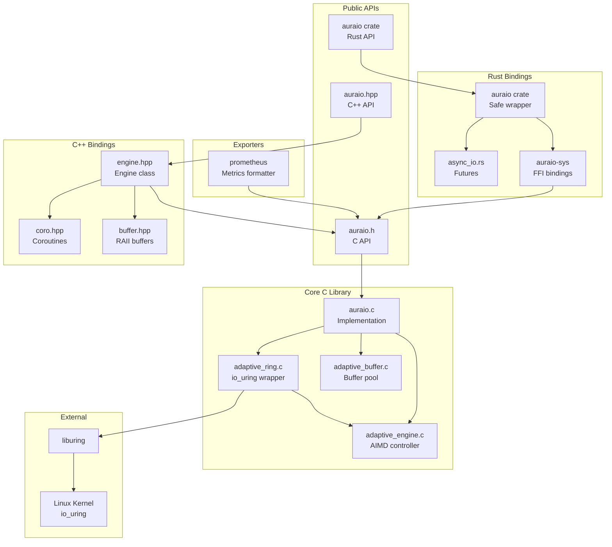
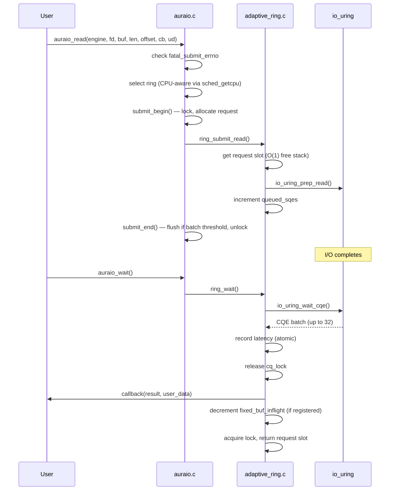
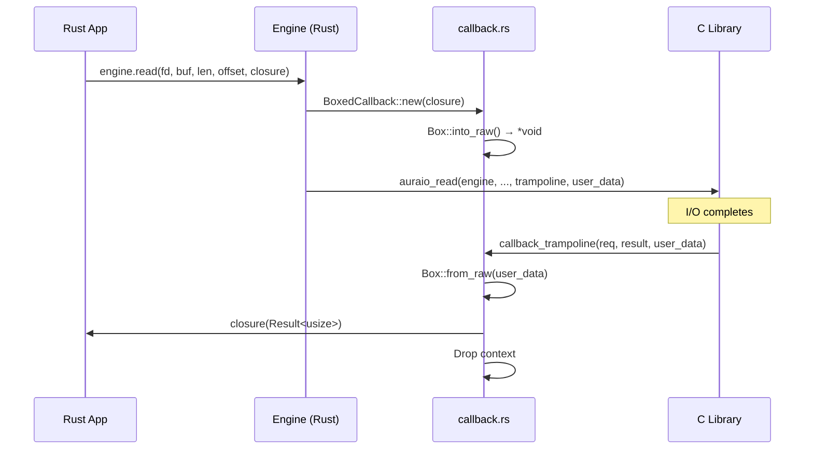
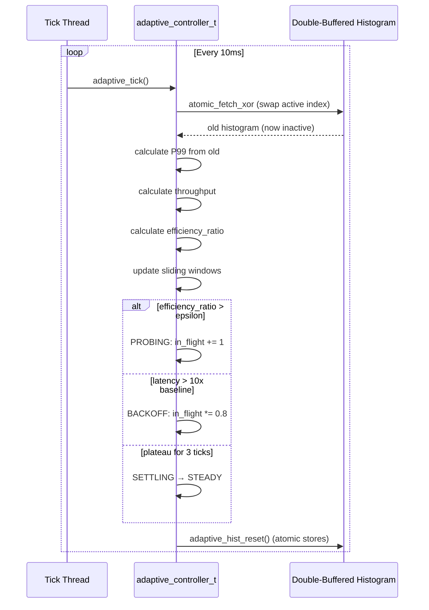
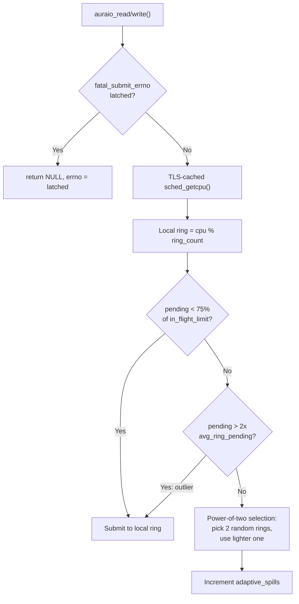

# AuraIO Codebase Map

> Auto-generated by Cartographer. Last mapped: 2026-02-08

## System Overview

AuraIO (Adaptive Uring Runtime Architecture) is a self-tuning asynchronous I/O library for Linux built on io_uring. It uses AIMD (Additive Increase Multiplicative Decrease) congestion control to automatically optimize I/O parameters for throughput and latency. The library provides C11, C++20, and Rust APIs.



## Directory Structure

```
AuraIO/
├── include/
│   ├── auraio.h              # Public C API (opaque types, all user-facing functions)
│   ├── auraio.hpp            # C++ umbrella header
│   └── auraio/
│       ├── engine.hpp        # Engine class with callbacks
│       ├── coro.hpp          # C++20 coroutine support (Task<T>, awaitables)
│       ├── buffer.hpp        # RAII buffer wrappers
│       ├── options.hpp       # Configuration wrapper
│       ├── request.hpp       # Request wrapper
│       ├── stats.hpp         # Stats wrapper
│       ├── error.hpp         # Exception types
│       ├── fwd.hpp           # Forward declarations
│       └── detail/
│           └── callback_storage.hpp  # Type-erased callback pool
├── src/
│   ├── auraio.c              # Public API implementation, ring selection, event loop
│   ├── adaptive_ring.c       # io_uring wrapper, request pool, completion handling
│   ├── adaptive_ring.h       # Ring internal interface
│   ├── adaptive_engine.c     # AIMD algorithm, P99 tracking, phase state machine
│   ├── adaptive_engine.h     # Adaptive controller interface, tuning constants
│   ├── adaptive_buffer.c     # Thread-safe aligned buffer pool with sharding
│   ├── adaptive_buffer.h     # Buffer pool interface
│   └── internal.h            # Shared utilities (timing, iovec helpers)
├── bindings/
│   └── rust/
│       ├── Cargo.toml        # Workspace: auraio-sys + auraio
│       ├── auraio-sys/       # Raw FFI bindings (bindgen-generated)
│       │   ├── build.rs      # Library detection + bindgen codegen
│       │   └── src/lib.rs    # Re-exports generated bindings
│       └── auraio/           # Safe Rust wrapper
│           └── src/
│               ├── lib.rs        # Public API re-exports, integration tests
│               ├── engine.rs     # Engine RAII wrapper, I/O methods
│               ├── buffer.rs     # Buffer (RAII) + BufferRef (Copy)
│               ├── callback.rs   # Type-erased FFI trampoline
│               ├── async_io.rs   # AsyncEngine trait, IoFuture
│               ├── options.rs    # Builder-pattern config
│               ├── request.rs    # RequestHandle (pending op)
│               ├── error.rs      # Error enum (thiserror)
│               └── stats.rs      # Stats snapshot
├── exporters/
│   └── prometheus/
│       ├── auraio_prometheus.h   # Prometheus formatter API
│       ├── auraio_prometheus.c   # Text exposition format implementation
│       └── example.c             # Minimal HTTP server on :9091/metrics
├── examples/
│   ├── C/
│   │   ├── quickstart.c      # Minimal read example
│   │   ├── simple_read.c     # Single file read with stats
│   │   ├── bulk_reader.c     # High-throughput directory scanner
│   │   ├── write_modes.c     # O_DIRECT vs buffered comparison
│   │   └── cancel_request.c  # In-flight request cancellation demo
│   ├── cpp/
│   │   ├── quickstart.cpp    # Minimal C++ async read
│   │   ├── simple_read.cpp   # C++ version of simple read
│   │   ├── bulk_reader.cpp   # C++ high-throughput scanner
│   │   ├── write_modes.cpp   # C++ write modes demo
│   │   └── coroutine_copy.cpp # C++20 coroutine file copy
│   ├── rust/
│   │   └── examples/
│   │       ├── quickstart.rs     # Minimal Rust async read
│   │       ├── simple_read.rs    # Read with stats reporting
│   │       ├── bulk_reader.rs    # Concurrent directory scanner
│   │       ├── file_copy.rs      # Synchronous-style file copy
│   │       ├── async_copy.rs     # Future-based async file copy
│   │       └── write_modes.rs    # O_DIRECT vs buffered comparison
│   └── Makefile
├── tools/
│   ├── api_surface/
│   │   ├── generate.sh          # Generate API snapshots (C, C++, Rust, Prometheus)
│   │   └── check_rfc_for_snapshot_change.sh  # CI: enforce RFC for API changes
│   ├── deps/
│   │   ├── check.sh             # Validate development environment dependencies
│   │   └── install_all.sh       # One-command dependency installation (apt-based)
│   └── BFFIO/                   # FIO-compatible I/O benchmark (powered by AuraIO)
│       ├── main.c               # CLI entry point, engine lifecycle
│       ├── job_parser.h/.c      # .fio INI parser + CLI arg parser
│       ├── workload.h/.c        # I/O loop, worker threads, file management
│       ├── stats.h/.c           # Latency histograms, percentiles, aggregation
│       ├── output.h/.c          # FIO-compatible text + JSON formatters
│       ├── test_BFFIO.sh        # Functional test suite (14 tests)
│       ├── run_baseline.sh      # FIO vs BFFIO comparison with delta report
│       └── Makefile
├── tests/
│   ├── test_engine.c         # AIMD algorithm tests
│   ├── test_ring.c           # Ring management tests
│   ├── test_buffer.c         # Buffer pool tests
│   ├── test_stats.c          # Observability API tests
│   ├── test_ring_select.c    # Ring selection mode tests (ADAPTIVE/CPU_LOCAL/ROUND_ROBIN)
│   ├── test_cpp.cpp          # C++ binding tests
│   ├── stress_test.cpp       # Multi-threaded stress test
│   ├── perf_bench.c          # Performance benchmarks (throughput, latency, scalability)
│   ├── bench_buffer.c        # Buffer pool microbenchmark
│   ├── test_concurrency_stress.c # Concurrency stress test (formerly repro_race.c)
│   ├── run_analysis.sh       # FIO comparison benchmark suite
│   ├── run_deep_analysis.sh  # Flamegraph/cachegrind/pahole profiling
│   ├── run_perf_test.sh      # Portable benchmark runner
│   └── Makefile
├── api/
│   └── snapshots/            # Generated API surface snapshots for freeze enforcement
│       ├── c_api.txt         # Public C API surface
│       ├── cpp_api.txt       # Public C++ API surface
│       ├── rust_api.txt      # Public Rust API surface
│       └── prometheus_metrics.txt  # Exported metric names
├── docs/
│   ├── api_reference.md      # Complete C and C++ API reference
│   ├── architecture.md       # Design philosophy, concurrency model, migration guide
│   ├── ASYNC_LIFECYCLE.md    # Two-phase error model, request handle lifetime
│   ├── BFFIO.md              # BFFIO benchmark tool usage and architecture
│   ├── COMPATIBILITY_POLICY.md # Pre-1.0/post-1.0 API stability rules
│   ├── observability.md      # Metrics API, Prometheus, sampling cost analysis
│   ├── OBSERVABILITY_CONTRACT.md # Prometheus schema versioning, metric contracts
│   ├── performance.md        # Hardware-aware I/O design, internal optimizations
│   └── rfcs/
│       └── README.md         # RFC template and process
├── pkg/
│   └── libauraio.pc.in       # pkg-config template
├── Makefile                   # Main build system
└── README.md                  # User documentation
```

## Module Guide

### Public C API (`include/auraio.h` + `src/auraio.c`)

**Purpose**: User-facing C interface tying together rings, buffers, and adaptive control

**Entry point**: `include/auraio.h`

| File | Purpose | Tokens |
|------|---------|--------|
| `include/auraio.h` | Public types and function declarations | 8,317 |
| `src/auraio.c` | API implementation, ring selection modes, merged flush+poll | 15,434 |

**Key Types**:
- `auraio_engine_t` - Opaque engine handle
- `auraio_request_t` - Opaque request handle
- `auraio_buf_t` - Unified buffer descriptor (regular or registered)
- `auraio_callback_t` - Completion callback: `void (*)(auraio_request_t*, ssize_t, void*)` (NULL valid for fire-and-forget)
- `auraio_fsync_flags_t` - Fsync variant enum: `DEFAULT`, `DATASYNC`
- `auraio_stats_t` - Statistics snapshot (includes `adaptive_spills` counter)
- `auraio_ring_stats_t` - Per-ring metrics (ops, bytes, in_flight_limit, p99, aimd_phase)
- `auraio_histogram_t` - Latency histogram (200 buckets x 50us, 0-10ms range)
- `auraio_buffer_stats_t` - Buffer pool stats (allocated bytes, buffers, shards)
- `auraio_options_t` - Engine configuration (includes `ring_select` mode)
- `auraio_ring_select_t` - Ring selection mode enum: `ADAPTIVE`, `CPU_LOCAL`, `ROUND_ROBIN`

**Key Functions**:
- Lifecycle: `auraio_create()`, `auraio_create_with_options()`, `auraio_destroy()`
- I/O: `auraio_read()`, `auraio_write()`, `auraio_readv()`, `auraio_writev()`, `auraio_fsync()`
- Event loop: `auraio_poll()`, `auraio_wait()`, `auraio_run()`, `auraio_stop()`
- Buffers: `auraio_buffer_alloc()`, `auraio_buffer_free()`
- Registered I/O: `auraio_register_buffers()`, `auraio_unregister_buffers()`, `auraio_request_unregister_buffers()`, `auraio_register_files()`, `auraio_unregister_files()`, `auraio_request_unregister_files()`, `auraio_update_file()`
- Observability: `auraio_get_stats()`, `auraio_get_ring_stats()`, `auraio_get_histogram()`, `auraio_get_buffer_stats()`, `auraio_get_ring_count()`
- Cancellation: `auraio_cancel()`
- Version: `auraio_version()`, `auraio_version_int()`, `auraio_phase_name()`

**Ring Selection Modes**:
- **ADAPTIVE** (default): CPU-local with power-of-two spilling. Gate 1: spill if local ring pending >= 75% of in-flight limit. Gate 2: stay local if pending > 2x global average (outlier). Spill target: pick 2 random non-local rings, use lighter one.
- **CPU_LOCAL**: Strict CPU-affinity via TLS-cached `sched_getcpu()`. Best NUMA locality, no cross-ring traffic.
- **ROUND_ROBIN**: Atomic fetch-add counter for even distribution across all rings. Maximum single-thread scaling.

**Optimizations**:
- TLS-cached `sched_getcpu()` in `select_ring()` (refreshed every 32 submissions)
- Thread-local xorshift32 PRNG for power-of-two ring selection
- Merged flush+poll in `auraio_wait()` with early exit on first completion
- Eventfd draining to prevent spurious epoll wakeups
- Drift-free tick thread using `clock_nanosleep()` with `TIMER_ABSTIME`

**Fatal Submit Error Latching**: First fatal `ring_flush()` error (not EAGAIN/EBUSY/EINTR) is latched atomically via `fatal_submit_errno`. All subsequent submissions fail immediately with the latched errno. The event loop is woken via eventfd to propagate the error. `auraio_poll()`/`auraio_wait()` return the error only after draining all pending completions.

**Submit Begin/End/Abort Pattern**: All I/O submission functions use a centralized `submit_begin()`/`submit_end()`/`submit_abort()` pattern that handles: fatal error checking, shutdown detection (`ESHUTDOWN`), ring lock acquisition, request slot allocation, conditional flushing, and guaranteed lock release on all paths.

**Registered Buffer Protection**: `pthread_rwlock_t reg_lock` serializes buffer/file registration with in-flight I/O. Read lock held during submission validation; write lock during register/unregister. Overflow-safe bounds checking: `offset >= iov_len || len > iov_len - offset` (prevents integer overflow). `auraio_destroy()` drains all pending I/O **before** unregistering buffers.

**Transparent Fixed-File Resolution**: Regular I/O calls automatically use registered files when available via `resolve_registered_file_locked()`. The caller need not use special APIs.

**Callback-Safe Unregister**: `auraio_request_unregister_buffers()` / `auraio_request_unregister_files()` enable deferred unregistration safe to call from completion callbacks. The synchronous variants (`auraio_unregister_buffers()` / `auraio_unregister_files()`) auto-detect callback context and degrade to deferred mode when needed. During drain, fixed-buffer submissions return `EBUSY`. Per-ring `fixed_buf_inflight` atomic counters track in-flight registered buffer ops for safe finalization. Finalization is checked in `auraio_poll()`, `auraio_wait()`, and `auraio_drain()`.

**Destroy Ordering**: `auraio_destroy()` follows strict ordering: (1) set `shutting_down` flag, (2) stop tick thread via `atomic_exchange` (prevents double-join), (3) stop event loop, (4) drain all pending I/O, (5) unregister buffers/files, (6) destroy rings and buffer pool.

**Dependencies**: All internal modules, liburing, pthread, eventfd

**Thread Safety**: Multiple threads can submit concurrently (per-ring locks); single thread should poll

---

### C++ Bindings (`include/auraio.hpp` + `include/auraio/*.hpp`)

**Purpose**: Modern C++20 interface with RAII, exceptions, concepts, and coroutines

**Entry point**: `include/auraio.hpp`

| File | Purpose | Tokens |
|------|---------|--------|
| `include/auraio.hpp` | Umbrella header | 427 |
| `include/auraio/engine.hpp` | Engine class, callbacks, concepts, per-ring stats, deferred unregister | 4,688 |
| `include/auraio/coro.hpp` | Task<T>, IoAwaitable, FsyncAwaitable | 3,250 |
| `include/auraio/buffer.hpp` | Buffer (RAII), BufferRef (explicit const ctor), engine lifetime tracking | 2,546 |
| `include/auraio/options.hpp` | Options wrapper with RingSelect | 1,242 |
| `include/auraio/request.hpp` | Request wrapper | 442 |
| `include/auraio/stats.hpp` | Stats, RingStats, Histogram, BufferStats | 1,316 |
| `include/auraio/error.hpp` | auraio::Error exception | 476 |
| `include/auraio/fwd.hpp` | Forward declarations | 94 |
| `include/auraio/detail/callback_storage.hpp` | 8-shard CallbackPool, type erasure | 2,135 |

**Key Classes**:
- `auraio::Engine` - **Non-movable** engine wrapper (locked `event_loop_mutex_` can't move); use `std::unique_ptr<Engine>` for heap allocation
- `auraio::Buffer` - RAII buffer owner (returns to pool on destruction)
- `auraio::BufferRef` - Lightweight buffer descriptor (explicit const ctor for safety)
- `auraio::Options` - Builder with `ring_select(RingSelect)` setter
- `auraio::RingSelect` - Enum: `Adaptive`, `CpuLocal`, `RoundRobin`
- `auraio::Stats` - Stats snapshot with `adaptive_spills()` getter
- `auraio::RingStats` - Per-ring metrics with `aimd_phase_name()` helper
- `auraio::Histogram` - Latency histogram with bucket accessors
- `auraio::BufferStats` - Buffer pool stats
- `auraio::Request` - Request wrapper
- `auraio::Error` - Exception with errno; predicates: `is_invalid()`, `is_again()`, `is_not_found()`, `is_cancelled()`, `is_busy()`

**Coroutine Support** (C++20):
- `Task<T>` - Lazy coroutine returning T; destructor calls `std::terminate()` if still pending (fail-fast, not UB)
- `IoAwaitable` - Awaitable for read/write (yields `ssize_t`); `completed_` atomic coordinates callback vs `await_suspend`
- `FsyncAwaitable` - Awaitable for fsync (yields `void`)
- Result consumption is destructive (`get()` moves out, subsequent calls throw)
- Uses `make_unsigned_t` cast in error conversion to avoid signed overflow UB on `SSIZE_MIN`

**Engine Destruction Safety**:
- `engine_alive_` set to `false` **before** calling `auraio_destroy()` — prevents race where concurrent Buffer destructor calls `auraio_buffer_free()` on freed engine handle
- Buffers that outlive the engine fall back to `free()` instead of pool return

**Patterns**:
- Type-erased callbacks via `std::function` + trampoline
- 8-shard `CallbackPool` for reduced mutex contention on many-core systems
- Non-movable semantics prevent accidentally moving a locked engine
- Thread-local shard assignment via thread ID hash
- `event_loop_mutex_` serializes `poll()`/`wait()`/`run()` (submissions remain lock-free)
- Deferred unregister: `request_unregister_buffers()` / `request_unregister_files()`
- O(1) callback cleanup: `on_complete` lambda set **before** submission (callback can fire immediately)

---

### Rust Bindings (`bindings/rust/`)

**Purpose**: Safe, idiomatic Rust wrapper with RAII, async/await, and zero-cost abstractions

**Entry point**: `bindings/rust/auraio/src/lib.rs`

| File | Purpose | Tokens |
|------|---------|--------|
| `auraio-sys/build.rs` | Library detection + bindgen codegen | 830 |
| `auraio-sys/src/lib.rs` | Raw FFI re-exports | 449 |
| `auraio/src/lib.rs` | Public API, integration tests | 8,907 |
| `auraio/src/engine.rs` | Engine RAII wrapper, all I/O methods, deferred unregister | 5,067 |
| `auraio/src/async_io.rs` | AsyncEngine trait, IoFuture, cancellation safety | 4,849 |
| `auraio/src/buffer.rs` | Buffer (RAII, Drop) + BufferRef (Copy) | 1,903 |
| `auraio/src/callback.rs` | BoxedCallback, FFI trampoline, panic catch | 508 |
| `auraio/src/options.rs` | Builder-pattern config with RingSelect | 855 |
| `auraio/src/request.rs` | RequestHandle (pending op) | 931 |
| `auraio/src/error.rs` | Error enum via thiserror | 278 |
| `auraio/src/stats.rs` | Stats snapshot | 348 |

**Architecture**:
```
Application
    ↓
auraio crate (safe API: Engine, Buffer, AsyncEngine)
    ↓
auraio-sys crate (raw FFI, bindgen-generated)
    ↓
libauraio.so (C library)
```

**Key Types**:
- `Engine` - RAII wrapper (`Send + Sync`), `Arc<EngineInner>` for shared ownership with `IoFuture`; destroyed on `Drop`
- `Buffer` - RAII pool buffer (`Send`, not `Sync`), freed on `Drop`
- `BufferRef` - Lightweight descriptor (`Copy`), no ownership
- `AsyncEngine` - Extension trait adding `async_read()`, `async_write()`, `async_fsync()`, `async_fdatasync()`, `async_readv()`, `async_writev()`
- `IoFuture` - Runtime-agnostic future for async I/O; explicitly `Send`
- `Options` - Builder with chainable setters including `ring_select(RingSelect)`
- `RingSelect` - Enum: `Adaptive`, `CpuLocal`, `RoundRobin`
- `Error` - `Io`, `EngineCreate`, `BufferAlloc`, `Submission`, `Cancelled`, `InvalidArgument`

**Callback Flow**:
1. Rust closure boxed as `BoxedCallback` (`Box<dyn FnOnce(Result<usize>) + Send>`)
2. `Box::into_raw()` transfers ownership to C library via `user_data` pointer
3. C library invokes `callback_trampoline()` on completion
4. Trampoline calls `Box::from_raw()`, invokes closure, drops context
5. Panics caught at FFI boundary via `catch_unwind` (prevents cross-FFI unwinding)

**Async Pattern**:
- `AsyncEngine` methods return `IoFuture` (shared `Arc<Mutex<IoState>>`)
- Callback stores result + invokes `Waker`
- Requires background thread calling `engine.wait()` to make progress
- Runtime-agnostic: no tokio/async-std dependency

**Async Cancellation Safety**:
- `request_consumed: Arc<AtomicBool>` prevents use-after-free in `IoFuture::drop()`
- Set to `true` with `Release` ordering **before** callback acquires the state mutex
- `IoFuture::drop()` checks `request_consumed` before calling `auraio_cancel()` — prevents cancelling a request whose handle is already invalid
- Lock dropped before FFI calls and `Waker::wake()` to prevent deadlock
- All mutex locks use `.unwrap_or_else(|e| e.into_inner())` for poisoned-mutex robustness

**Engine Lifetime**:
- `Engine::inner` is `Arc<EngineInner>`, shared with `IoFuture` instances
- `poll_lock: Mutex<()>` serializes poll/wait/run (submissions remain lock-free)
- errno captured **before** cleanup `drop()` calls (drop could clobber errno)
- Deadlock warnings: never call poll/wait/run from within a completion callback

**Deferred Unregistration**:
- `request_unregister_buffers()` / `request_unregister_files()` — callback-safe lazy unregister

**Gotchas**:
- `RequestHandle` becomes **invalid** after callback starts (dangling pointer)
- Inline C functions (`auraio_buf`, `auraio_buf_fixed`) reimplemented in Rust (bindgen can't handle inline)
- Async futures don't progress without `engine.wait()` calls
- `wrapping_neg()` used for errno conversion to avoid overflow panic on `isize::MIN`
- Dropping `IoFuture` does **not** cancel the kernel operation (buffer must outlive kernel I/O)

---

### Prometheus Exporter (`exporters/prometheus/`)

**Purpose**: Standalone Prometheus text exposition format formatter for AuraIO metrics

| File | Purpose | Tokens |
|------|---------|--------|
| `auraio_prometheus.h` | Formatter API, schema version constants | 444 |
| `auraio_prometheus.c` | Text format implementation | 2,513 |
| `example.c` | HTTP server on :9091 | 1,280 |

**API**: `auraio_metrics_prometheus(engine, buf, buf_size)` — returns bytes written (clamped to `INT_MAX`), or negative on error

**Return Contract**:
- Success: bytes written (0 to `INT_MAX`)
- Buffer too small: negative estimate with `errno=ENOBUFS` (retriable — allocate `abs(return_value)` bytes)
- Hard failure: -1 with `errno=ENOMEM` (not retriable)

**Metrics exported** (30+):
- Aggregate: ops_completed, bytes_transferred, throughput, p99_latency, in_flight, ring_count
- Per-ring: ops, bytes, in_flight, in_flight_limit, batch_threshold, queue_depth, p99, throughput, aimd_phase
- Per-ring histograms: latency distribution with cumulative buckets (only non-zero buckets emitted)
- Buffer pool: allocated_bytes, buffers, shards

**Patterns**:
- `PROM_APPEND` macro for safe buffer building with overflow detection
- `size_t` accumulation with `INT_MAX` clamping prevents integer overflow on large outputs
- NaN/Inf clamped to 0.0 (Prometheus format compliance)
- Cumulative histogram buckets (per Prometheus spec)
- Schema versioning: `AURAIO_PROMETHEUS_SCHEMA_VERSION` ("v0"), `AURAIO_PROMETHEUS_SCHEMA_STABILITY` ("experimental")
- Emits `auraio_metrics_schema_info` metric for schema discovery
- OOM returns `ENOMEM` (-1) rather than jumping to overflow label
- No external dependencies beyond libc

**Gotchas**:
- Histogram sum is estimated using bucket midpoints (not exact)
- On overflow, returns `-(written * 2 + 4096)` as conservative retry estimate (clamped to `INT_MIN` if needed)
- Example server is demo-quality (not production-grade, best-effort writes)

---

### BFFIO Benchmark Tool (`tools/BFFIO/`)

**Purpose**: FIO-compatible I/O benchmark that uses AuraIO as its sole engine, demonstrating AIMD adaptive tuning advantages over fixed-depth io_uring

**Entry point**: `tools/BFFIO/main.c`

| File | Purpose | Tokens |
|------|---------|--------|
| `main.c` | CLI entry point, engine lifecycle, job dispatch | 2,327 |
| `job_parser.h` | Config structs (`job_config_t`, `bench_config_t`, `rw_pattern_t`) | 750 |
| `job_parser.c` | .fio INI parser + CLI `--flag=value` parser with `[global]` inheritance | 4,925 |
| `workload.h` | Worker types (`io_ctx_t`, `io_ctx_pool_t`, `thread_ctx_t`, `file_set_t`) | 768 |
| `workload.c` | I/O submit loop, worker threads, file setup, convergence detection | 6,198 |
| `stats.h` | Per-thread atomic stats, histogram (200 buckets x 50us), sample arrays | 1,051 |
| `stats.c` | Atomic recording, CAS min/max, histogram percentiles, aggregation | 4,485 |
| `output.h` | Formatter API (`output_normal`, `output_json`) | 253 |
| `output.c` | FIO-compatible text + FIO 3.36 JSON with `"AuraIO"` section | 6,785 |
| `test_BFFIO.sh` | Functional test suite (20+ tests) | 2,309 |
| `run_baseline.sh` | FIO vs BFFIO comparison with delta report + regression detection | 5,180 |
| `Makefile` | Build system with libauraio.a dependency | 285 |

**Key Design Patterns**:
- One fresh AuraIO engine per job — clean AIMD convergence per workload
- Pre-allocated `io_ctx_pool_t` per thread — zero malloc on I/O hot path (spinlock-protected for cross-thread callbacks)
- Per-thread `thread_stats_t` with relaxed atomics — no shared lock for stats
- CAS loops for min/max latency tracking
- xorshift64 PRNG for random offsets and rwmix decisions
- Two-phase measurement: ramp (discarded) + steady-state (reported)

**AIMD Auto-Tuning (`--target-p99`)**:
- User specifies P99 latency ceiling (e.g., `--target-p99=2ms`)
- Engine starts at `initial_in_flight=4`, AIMD probes upward
- Auto-scales `numjobs` to match ring count (one thread per ring for convergence)
- Stats reset when all rings reach STEADY/CONVERGED phase
- Output shows `max concurrency=N at p99=X.XXms (target: Y.YYms)`

**FIO Compatibility**:
- Accepts `.fio` job files with `[global]` and `[job]` sections
- Supports all common CLI flags (`--rw`, `--bs`, `--size`, `--direct`, etc.)
- JSON output matches FIO 3.36 structure (`jobs[].read/write` with percentiles)
- Adds `"AuraIO"` section in JSON with `final_depth`, `phase`, `p99_ms`
- Text output matches FIO format (IOPS/BW line, latency summary, percentile table)

**Thread Model**:
- N worker threads (pthread): submit loop + `auraio_wait(1ms)` + repeat
- Main thread: 1Hz timer for ramp detection, convergence polling, BW/IOPS sampling, runtime expiry
- Callbacks fire on any thread (hence spinlock-protected context pool)

**Gotchas**:
- File creation writes real 0xA5 pattern (defeats ext4 unwritten-extent optimization)
- O_DIRECT attempted first with buffered I/O fallback
- Histogram overflow bucket for latencies > 10ms
- `queue_depth` set to `iodepth * 2` (min 256) so AIMD has headroom below submission cap

See [docs/BFFIO.md](BFFIO.md) for full usage documentation.

---

### Ring Manager (`src/adaptive_ring.c/.h`)

**Purpose**: io_uring wrapper with request tracking, batching, and per-ring adaptive control

**Entry point**: `src/adaptive_ring.h`

| File | Purpose | Tokens |
|------|---------|--------|
| `src/adaptive_ring.h` | Ring interface, request struct, latency sampling config | 2,296 |
| `src/adaptive_ring.c` | Ring implementation, COOP_TASKRUN, batched CQE extraction, callback context tracking | 7,008 |

**Key Types**:
- `ring_ctx_t` - Per-ring context (io_uring, request pool, mutex, adaptive controller, `fixed_buf_inflight` counter)
- `auraio_request_t` - Request with callback, timing, cancellation state, `uses_registered_buffer`/`uses_registered_file` flags
- `auraio_op_type_t` - Includes `AURAIO_OP_READ_FIXED` and `AURAIO_OP_WRITE_FIXED`

**Key Functions**:
- `ring_init()`, `ring_destroy()` - Lifecycle (destroy has 10-second drain timeout)
- `ring_submit_read()`, `ring_submit_write()`, `ring_submit_fsync()` - Submission
- `ring_submit_read_fixed()`, `ring_submit_write_fixed()` - Registered buffer I/O
- `ring_poll()`, `ring_wait()` - Completion processing (batched, up to 32 CQEs per lock hold)
- `ring_get_request()`, `ring_put_request()` - O(1) request pool
- `ring_in_callback_context()` - TLS depth counter for callback context detection
- `sqe_apply_fixed_file()` - Applies `IOSQE_FIXED_FILE` flag when using registered files

**Patterns**:
- Free stack for O(1) request allocation
- Lock released during callback to allow re-entrant submission
- SQPOLL with graceful fallback to normal mode
- `process_completion()` manages its own locking internally
- `IORING_SETUP_COOP_TASKRUN` for cooperative completions (kernel 5.19+)
- Selective request zeroing (only fields that vary between op types)
- Batched CQE extraction (up to 32 per lock hold, `RING_POLL_BATCH`)
- 1-in-8 latency sampling (`RING_LATENCY_SAMPLE_RATE`)
- Callback info saved **before** marking `pending=false` (prevents slot reuse during callback)
- `fixed_buf_inflight` decremented **after** callback returns

**Destroy Path**: (1) flush batched SQEs, (2) drain with retry-flush and 100ms waits (max 10 seconds), (3) destroy adaptive controller, (4) free resources, (5) exit io_uring. Flush-before-drain prevents `ring_wait()` from blocking on never-submitted SQEs. Timeout prevents infinite hang on stuck devices (e.g., hung NFS).

**Gotchas**:
- Request handle only valid until callback begins
- Callers must NOT hold lock when calling `process_completion()`
- Callbacks can submit new I/O (re-entry safe)
- `pending_count` momentarily inflated by 1 during callback execution

---

### Adaptive Engine (`src/adaptive_engine.c/.h`)

**Purpose**: AIMD congestion control for automatic I/O tuning

**Entry point**: `src/adaptive_engine.h`

| File | Purpose | Tokens |
|------|---------|--------|
| `src/adaptive_engine.h` | Controller interface, constants, cache-line layout | 3,204 |
| `src/adaptive_engine.c` | AIMD implementation, low-IOPS handling | 4,020 |

**Key Types**:
- `adaptive_controller_t` - Per-ring controller state
- `adaptive_phase_t` - State machine phases
- `adaptive_histogram_pair_t` - Double-buffered P99 latency tracking (50us buckets, 200 buckets)

**Key Functions**:
- `adaptive_init()`, `adaptive_destroy()` - Lifecycle
- `adaptive_tick()` - Called every 10ms, runs AIMD algorithm
- `adaptive_record_completion()` - Record latency sample (lock-free atomic)
- `adaptive_get_inflight_limit()`, `adaptive_get_batch_threshold()` - Current tuned values
- `adaptive_hist_swap()` - O(1) atomic index flip for double-buffered histograms

**AIMD State Machine**:
```
BASELINE (warmup, 100ms)
    ↓
PROBING (additive increase: +1/tick)
    ↓ plateau (efficiency_ratio ≤ epsilon for 3 ticks) OR latency spike (2 consecutive)
BACKOFF (multiplicative decrease: x0.8)
    ↓
SETTLING (wait 100ms)
    ↓
STEADY (maintain config)
    ↓ stable for 5s
CONVERGED (no more changes)
```

**Key Constants** (tuned for NVMe SSDs):
```c
ADAPTIVE_SAMPLE_INTERVAL_MS    = 10     // Tick every 10ms
ADAPTIVE_WARMUP_SAMPLES        = 10     // 100ms baseline
ADAPTIVE_AIMD_INCREASE         = 1      // Add 1 per tick
ADAPTIVE_AIMD_DECREASE         = 0.80   // Cut 20% on backoff
ADAPTIVE_LATENCY_GUARD_MULT    = 10.0   // Backoff if P99 > 10x baseline
ADAPTIVE_DEFAULT_LATENCY_GUARD = 10.0   // Hard ceiling: 10ms P99
```

**Double-Buffered Histogram**: O(1) `atomic_fetch_xor` flips active index. Tick reads P99 from the swapped-out histogram while new samples go to the other one. ~1-3 samples may be lost during swap (tolerable for statistical metrics).

**Low-IOPS Handling**: Extended sample window (100ms-1000ms) when fewer than 20 samples are available. P99 with 20 samples is effectively P95 (acceptable for slow storage).

**Efficiency Ratio**: Tracks `Δthroughput / Δin_flight` to detect plateau — when ratio ≤ epsilon for 3 consecutive ticks, transitions to SETTLING.

**Cache-Line Layout**: `adaptive_controller_t` hot fields (limits, counters) packed into cache line 0; tick-only state (phase, sliding windows) in subsequent lines

**Gotchas**:
- Histogram swap loses ~1-3 samples (race between pointer swap and reset)
- P99 requires minimum 20 samples for validity
- Low-IOPS handling: extended sample window when insufficient data

---

### Buffer Pool (`src/adaptive_buffer.c/.h`)

**Purpose**: Thread-safe 4KB-aligned buffer pool with size-class buckets

**Entry point**: `src/adaptive_buffer.h`

| File | Purpose | Tokens |
|------|---------|--------|
| `src/adaptive_buffer.h` | Pool interface | 1,433 |
| `src/adaptive_buffer.c` | Pool implementation, TLS caching, CAS registration | 6,431 |

**Three-Tier Architecture**:
```
Thread Cache (TLS, no lock, ~10ns)
    ↓ cache miss
Shard (per-shard lock, ~50ns)
    ↓ shard empty
posix_memalign (slow path)
```

**Size Classes**: 16 classes from 4KB to 128MB (power-of-2). Fast-path cascade for 7 most common sizes (4KB-256KB) avoids `__builtin_clzl()` overhead.

**Auto-Scaling Shards**: 2-256 shards (~4 threads/shard target, power-of-2 rounding)

**Pool Destroy Race Prevention**:
- `pool_id` (global atomic generation counter) detects stale caches from address-reused pools
- `destroyed` atomic flag checked before dereferencing pool
- `registrations_inflight` counter: incremented during cache registration, destroy waits for quiescence
- `cleanup_mutex` per cache: serializes buffer cleanup between TLS destructor and pool destroy — whoever gets the lock first handles buffers (sets `cleaned_up=true`), loser skips
- `thread_exited` flag: tracks whether TLS destructor has run, determines who frees the cache struct
- Pool destroy sets `cache->pool = NULL` to mark orphaned caches; `get_thread_cache()` detects and frees them

**Patterns**:
- `__builtin_clzl()` for O(1) size-to-class mapping
- Batch transfers (8 at a time) between cache and shard
- High-water mark limits cached buffers (default 256/shard)
- Lock-free TLS cache registration via CAS
- Pre-allocated metadata slots per shard (eliminates malloc on free path)

**Known Limitation**: A thread that has already passed the `destroyed` check in `get_thread_cache()` but not yet registered its cache may retain its TLS cache (~2KB) until thread exit. Acceptable for the shutdown path.

---

### Internal Utilities (`src/internal.h`)

**Purpose**: Shared utilities across modules

| File | Purpose | Tokens |
|------|---------|--------|
| `src/internal.h` | Timing, iovec helpers, TSan annotations | 525 |

**Exports**:
- `get_time_ns()` - Monotonic nanosecond clock (CLOCK_MONOTONIC)
- `iovec_total_len()` - Safe vectored I/O size with overflow check
- `TSAN_RELEASE()`/`TSAN_ACQUIRE()` - ThreadSanitizer annotations for io_uring's kernel-mediated synchronization

---

## Data Flow

### Read Operation



### Rust Callback Flow



### Adaptive Tuning Flow



### Ring Selection (ADAPTIVE mode)



## Optimization Techniques

| Technique | Location | Impact |
|-----------|----------|--------|
| TLS-cached CPU routing | `auraio.c:select_ring()` | Refresh `sched_getcpu()` every 32 ops, not every op |
| Merged flush+poll | `auraio.c:auraio_wait()` | Single-pass with early exit on first completion |
| COOP_TASKRUN | `adaptive_ring.c:ring_init()` | Cooperative completions, fewer context switches (kernel 5.19+) |
| Batched CQE extraction | `adaptive_ring.c:ring_poll()` | Up to 32 CQEs per lock hold, O(n/32) mutex overhead |
| Selective request zeroing | `adaptive_ring.c:ring_get_request()` | Only zero variant fields, skip fields overwritten by caller |
| 1-in-8 latency sampling | `adaptive_ring.c:process_completion()` | ~1250 samples/sec at 10K IOPS, sufficient for P99 |
| TLS buffer cache | `adaptive_buffer.c` | Zero-lock fast path (~10ns), CAS-based registration |
| Fast size-class cascade | `adaptive_buffer.c:size_to_class()` | Avoids `__builtin_clzl()` for 7 most common sizes |
| Cache-line layout | `adaptive_engine.h` | Hot atomics in cache line 0, cold tick state in line 1+ |
| Double-buffered histogram | `adaptive_engine.c` | O(1) atomic index flip, no memcpy |
| Eventfd draining | `auraio.c:auraio_wait()` | Prevents spurious epoll wakeups after completions |
| Power-of-two ring spilling | `auraio.c:select_ring()` | ADAPTIVE mode: pick 2 random rings, use lighter one |
| Drift-free ticking | `auraio.c:tick_thread()` | `clock_nanosleep(TIMER_ABSTIME)` prevents drift from EINTR |
| TSan annotations | `internal.h` | `TSAN_RELEASE/ACQUIRE` for io_uring kernel synchronization |
| Submit begin/end pattern | `auraio.c` | Centralized lock+error handling, no request slot leaks |
| Transparent fixed-file | `auraio.c` | Auto-resolves registered files, no special API needed |

## Thread Safety

| Component | Mechanism | Notes |
|-----------|-----------|-------|
| Ring submission | `pthread_mutex_t` per ring | Released during callback |
| Ring completion | `pthread_mutex_t cq_lock` per ring | Separate from SQ lock, released before blocking wait |
| Request state | Atomics (`pending`, `cancel_requested`) | Lock-free checks |
| Histogram recording | Atomic increments | No lock needed |
| Histogram swap | Atomic index flip (`fetch_xor`) | O(1) operation, ~1-3 samples lost |
| Buffer TLS cache | Thread-local storage | Zero lock fast path |
| Buffer shards | Per-shard mutex | Round-robin selection |
| Buffer pool destroy | `cleanup_mutex` per cache + `destroyed` atomic | Coordinates TLS destructor vs pool destroy |
| Buffer pool registration | `registrations_inflight` atomic | Destroy waits for quiescence |
| Engine stats | Atomics with release/acquire | ARM/PowerPC safe |
| Fatal submit errno | Atomic CAS (latch first error) | Eventfd wakeup for propagation |
| Shutdown flag | `_Atomic bool shutting_down` | Set by destroy, checked by submit_begin |
| Fixed buf inflight | `_Atomic uint32_t` per ring | Track registered buffer ops for safe unregister |
| C++ CallbackPool | Mutex-protected allocation | Short-lived |
| C++ event_loop_mutex_ | `std::mutex` | Serializes poll/wait/run; submissions lock-free |
| C++ engine_alive_ | `shared_ptr<atomic<bool>>` | Buffer outlives engine safely |
| Rust Engine | `Send + Sync` via `Arc<EngineInner>` | C library handles locking |
| Rust IoFuture | `Arc<Mutex<IoState>>` + `Arc<AtomicBool>` | Waker notification + cancellation safety |
| Rust poll_lock | `Mutex<()>` | Serializes poll/wait/run |
| Rust callback trampoline | `catch_unwind` | Prevents cross-FFI panic unwinding |
| Ring selection counter | `_Atomic unsigned int` | Round-robin mode: atomic fetch-add |
| Average pending | `_Atomic int` | Updated by tick thread, read by ADAPTIVE select |
| Callback context | `_Thread_local int` | TLS depth counter for re-entrant callback detection |
| Deferred unregister | `_Atomic bool` pending flags | Coordinate drain between callback and polling threads |

### Lock Hierarchy (prevents deadlock)
1. Buffer pool shards (independent, no nesting)
2. Ring locks (independent, no nesting)
3. Engine pending_mutex (C++ only, short-lived)

### Thread Roles
- **Application threads**: Submit I/O (per-ring locks)
- **Poll thread**: Single thread calls poll/wait (releases lock for callbacks)
- **Tick thread**: Runs every 10ms, lock-free stats via atomics
- **SQPOLL threads** (optional): Kernel threads auto-submit SQEs
- **Rust background poller** (async pattern): Calls `engine.wait()` for future progress

## Test Infrastructure

### Unit Tests

| Test | Focus | File |
|------|-------|------|
| test_engine | AIMD algorithm, phase transitions | `tests/test_engine.c` |
| test_ring | Ring lifecycle, submission, completion | `tests/test_ring.c` |
| test_buffer | Buffer pool alloc/free, size classes | `tests/test_buffer.c` |
| test_stats | Observability API, per-ring stats, histograms | `tests/test_stats.c` |
| test_ring_select | Ring selection modes, ADAPTIVE spill verification | `tests/test_ring_select.c` |
| test_cpp | C++ bindings: RAII, callbacks, coroutines, concepts, deferred unregister, buffer-outlives-engine | `tests/test_cpp.cpp` |
| stress_test | Multi-threaded concurrent I/O | `tests/stress_test.cpp` |
| test_concurrency_stress | Multi-thread submit + aggressive poll stress | `tests/test_concurrency_stress.c` |
| Rust tests | FFI bindings, safe API, async I/O, cancellation safety | `bindings/rust/auraio/src/lib.rs` |

### Performance Benchmarks (`tests/perf_bench.c`)

Six benchmark modes:
- **Throughput**: 64K random reads, max inflight 256
- **Latency**: 4K serial reads, depth=1, min/avg/max/P99
- **Scalability**: Varying queue depth 4-128
- **Mixed**: 70% reads, 25% writes, 5% fsync
- **Syscall**: Measures ops per `io_uring_enter`
- **Buffer pool**: Multi-threaded alloc/free stress

Each benchmark runs in a separate fork to avoid io_uring kernel state contamination.

### Analysis Scripts

| Script | Purpose |
|--------|---------|
| `run_analysis.sh` | FIO comparison suite with apples-to-apples mode (recommended) |
| `run_deep_analysis.sh` | Flamegraphs, cachegrind, pahole, callgrind, perf c2c |
| `run_perf_test.sh` | Portable benchmark runner (earlier iteration) |

**`run_analysis.sh`** profiles: `--quick` (3s), `--standard` (5s), `--full` (10s). Generates Python report with FIO vs AuraIO comparison tables, percentage deltas, and key findings.

**`run_deep_analysis.sh`** phases: CPU flamegraphs, lock contention, cache behavior, struct layout (pahole), callgraph, false sharing detection. Generates automated optimization recommendations.

### Build Targets

```bash
# Core tests
make test              # C unit tests (parallel build + serial run)
make test-all          # C + C++ + Rust with unified summary

# Sanitizers
make test-sanitizers   # Valgrind + TSan + ASan combined summary
make test-memory       # TSan + ASan only
make test-strict       # Full suite (all + memory sanitizers)

# Coverage
make coverage          # Build/run tests with llvm-cov
make coverage-check    # Enforce minimum line coverage

# BFFIO benchmark tool
make BFFIO             # Build BFFIO
make BFFIO-test        # Run BFFIO functional tests (20+ tests)
make BFFIO-baseline    # FIO vs BFFIO comparison with delta report

# Benchmarks
make bench             # FIO comparison (5s/test)
make bench-quick       # Quick (3s/test)
make bench-deep        # Deep profiling (flamegraphs, cachegrind)

# Dependencies
make deps              # Interactive installer (kernel >= 6.0 required)
make deps-check        # Verify availability

# Exporters
make exporters         # Build Prometheus exporter example
```

## Conventions

- **Naming**: Snake_case; `auraio_` prefix for public, `ring_`/`adaptive_`/`buffer_` for internal
- **Types**: Opaque handles for public API, full structs internal
- **Memory**: Pre-allocate pools, avoid malloc on hot paths
- **Locking**: Release around callbacks, batch to reduce lock acquisitions
- **Errors**: Return negative errno (C), throw `auraio::Error` (C++), `Result<T>` (Rust)
- **C++ Style**: RAII, non-movable Engine, move-only Buffer, concepts for type safety
- **Rust Style**: RAII via Drop, `NonNull` for pointer safety, extension traits for async, `Arc<EngineInner>` for shared ownership
- **C11 Compliance**: `_Thread_local` (not `__thread`), `_Static_assert`, `<stdatomic.h>` with explicit memory orderings
- **Build**: `-Wall -Wextra -Wshadow -Wpedantic -std=c11 -O2 -fPIC -fvisibility=hidden`

## Gotchas

1. **Request handle lifetime**: Only valid until callback begins - do not store
2. **Callback deadlock**: Never call `auraio_destroy()` from callback
3. **Shutdown order**: Stop worker threads before calling `auraio_destroy()`
4. **Buffer pool TLS**: Only first pool accessed per thread gets cache benefit
5. **Registered buffer lifetime**: No in-flight I/O during unregister
6. **SQPOLL**: May silently fall back without root/CAP_SYS_NICE
7. **Low-IOPS devices**: Tick may skip if < 20 samples and < 100ms elapsed
8. **Histogram race (by design)**: ~1-3 samples lost during swap; uses atomic stores for reset, not memset
9. **process_completion() locking**: Callers must NOT hold lock when calling it
10. **Rust inline functions**: `auraio_buf`/`auraio_buf_fixed` reimplemented (bindgen can't handle inline)
11. **Rust async polling**: Futures don't progress without background `engine.wait()` calls
12. **Rust RequestHandle**: Becomes dangling pointer after callback starts (most dangerous Rust gotcha)
13. **Prometheus histogram sum**: Estimated via midpoint (not exact)
14. **Coroutine ownership**: Task must remain alive until completion; destructor calls `std::terminate()` if still pending
15. **Coroutine result**: `Task<T>::get()` is destructive — moves result out, subsequent calls throw `std::logic_error`
16. **Registered file update**: `auraio_update_file()` is non-atomic across rings — partial failure leaves inconsistent state
17. **C++ BufferRef const**: Explicit constructor from `const void*` prevents accidental use with read operations
18. **TSan ASLR**: Kernel >= 6.5 needs `setarch --addr-no-randomize` workaround
19. **Deferred unregister EBUSY**: Fixed-buffer submissions return `EBUSY` while unregister is draining
20. **C++ Buffer outlives Engine**: Safe — `engine_alive_` atomic flag triggers fallback to `free()`
21. **Event loop serialization**: `poll()`/`wait()`/`run()` are mutually exclusive (submissions remain lock-free)
22. **Callback context detection**: `ring_in_callback_context()` uses TLS depth counter — safe for nested callbacks
23. **Fatal submit latch**: Only first fatal `ring_flush()` error is latched; subsequent errors ignored; completions still drain
24. **Ring destroy timeout**: `ring_destroy()` gives up after 10 seconds (prevents infinite hang on stuck devices)
25. **Buffer pool destroy TLS leak**: Threads mid-registration may retain ~2KB TLS cache until thread exit
26. **Rust IoFuture drop**: Does NOT cancel the kernel operation — buffer must outlive kernel I/O
27. **Rust cancellation safety**: `request_consumed` atomic prevents cancelling a request whose handle is already invalid
28. **C++ Engine non-movable**: `event_loop_mutex_` cannot be moved; use `std::unique_ptr<Engine>` for heap allocation
29. **Prometheus overflow**: Returns `-(written * 2 + 4096)` estimate clamped to `INT_MIN`; check `errno` for `ENOBUFS` vs `ENOMEM`
30. **Rust poll/wait deadlock**: Never call poll/wait/run from within a completion callback (deadlocks on `poll_lock`)
31. **Overflow-safe bounds checking**: Registered buffer validation uses `offset >= iov_len || len > iov_len - offset` (not `offset + len > iov_len`)

## Navigation Guide

**To add a new public API function**:
1. Declare in `include/auraio.h`
2. Implement in `src/auraio.c` (use `submit_begin()`/`submit_end()` pattern for I/O ops)
3. Add C++ wrapper in `include/auraio/engine.hpp`
4. Add Rust wrapper in `bindings/rust/auraio/src/engine.rs`
5. Re-export from `bindings/rust/auraio/src/lib.rs`

**To modify adaptive tuning behavior**:
1. Constants at top of `src/adaptive_engine.h`
2. Algorithm in `adaptive_tick()` in `src/adaptive_engine.c`

**To add a new I/O operation type**:
1. Add enum value to `auraio_op_type_t` in `src/adaptive_ring.h`
2. Add `ring_submit_*()` function in `src/adaptive_ring.c`
3. Expose via public API in `auraio.c` and `auraio.h`
4. Add C++ method in `include/auraio/engine.hpp`
5. Add awaitable in `include/auraio/coro.hpp` if applicable
6. Add Rust method in `bindings/rust/auraio/src/engine.rs`
7. Add async variant in `bindings/rust/auraio/src/async_io.rs` if applicable

**To add a new BFFIO feature**:
1. Add config field to `job_config_t` in `tools/BFFIO/job_parser.h`
2. Parse it in `job_parser.c` (both CLI and .fio file paths)
3. Use it in `workload.c` I/O loop
4. Output it in `output.c` (both normal text and JSON)
5. Add test case in `test_BFFIO.sh`

**To add Prometheus metrics**:
1. Add stat to public API in `include/auraio.h` (if new)
2. Add formatting in `exporters/prometheus/auraio_prometheus.c`

**To add a new Rust feature**:
1. Implement in appropriate `bindings/rust/auraio/src/*.rs` file
2. Re-export from `lib.rs`
3. Add tests in `lib.rs` test module
4. Add example in `examples/rust/examples/`

**To update API snapshots after public API changes**:
1. Run `tools/api_surface/generate.sh`
2. Create RFC in `docs/rfcs/` if API freeze is enforced (`ENFORCE_API_FREEZE=1`)

**Build and test**:
```bash
orb -m linux bash -c "make test"           # C tests
orb -m linux bash -c "make test-all"       # C + C++ + Rust
orb -m linux bash -c "make test-sanitizers" # Valgrind + TSan + ASan
orb -m linux bash -c "make bench"           # Performance vs FIO
```

## Examples Reference

| Example | Language | Purpose |
|---------|----------|---------|
| `quickstart.c/cpp/rs` | C/C++/Rust | Minimal async read |
| `simple_read.c/cpp/rs` | C/C++/Rust | Read with stats |
| `bulk_reader.c/cpp/rs` | C/C++/Rust | High-throughput scanner |
| `write_modes.c/cpp/rs` | C/C++/Rust | O_DIRECT vs buffered |
| `cancel_request.c` | C | In-flight request cancellation |
| `coroutine_copy.cpp` | C++20 | Coroutine file copy |
| `file_copy.rs` | Rust | Synchronous-style copy |
| `async_copy.rs` | Rust | Future-based async copy |

## Documentation Reference

| Document | Covers |
|----------|--------|
| `docs/api_reference.md` | Complete C/C++ API: types, functions, error codes, callback rules |
| `docs/architecture.md` | Design philosophy, concurrency model, migration guide |
| `docs/ASYNC_LIFECYCLE.md` | Two-phase error model (submission vs completion), request handle lifetime |
| `docs/BFFIO.md` | BFFIO benchmark tool: usage, --target-p99, output formats, architecture |
| `docs/COMPATIBILITY_POLICY.md` | Pre-1.0/post-1.0 API stability rules, RFC requirements |
| `docs/observability.md` | Metrics API, Prometheus integration, sampling cost analysis, PromQL examples |
| `docs/OBSERVABILITY_CONTRACT.md` | Prometheus schema versioning, metric contracts, snapshot consistency model |
| `docs/performance.md` | Hardware-aware I/O design, buffer registration, optimization tips, internal micro-optimizations |
| `docs/rfcs/README.md` | RFC template and process for API changes |
