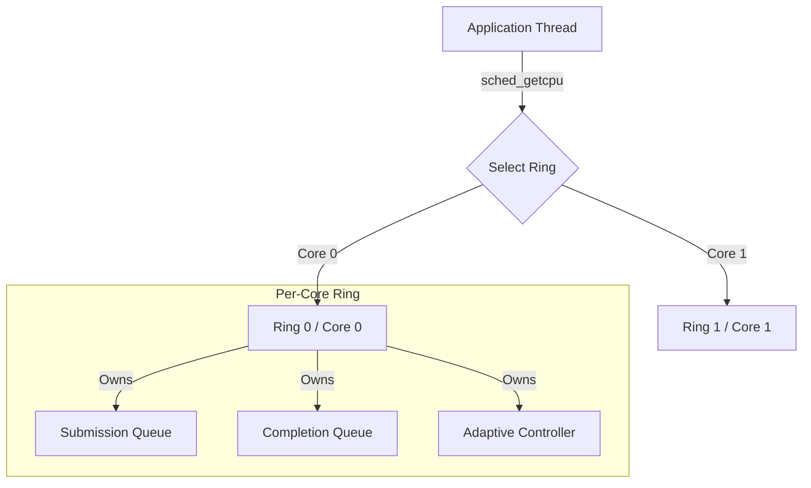

# AuraIO Architecture Guide
Adaptive Uring Runtime Architecture

## System Overview

AuraIO is designed as a **ring-per-core** asynchronous I/O runtime. Unlike traditional reactor patterns that use a single event loop or a thread pool for callbacks, AuraIO dedicates an `io_uring` instance to each CPU core and routes submissions to the local core's ring. This architecture minimizes cross-core traffic, maximizes cache locality, and eliminates the "thundering herd" problem common in high-concurrency network servers.

## Core Components

### 1. Engine (`aura_engine_t`)
The high-level container that manages the lifecycle of the entire runtime.
- **Topology**: Automatically detects CPU core count (`sysconf(_SC_NPROCESSORS_ONLN)`) and creates a corresponding number of Rings.
- **Unified EventFD**: Maintains a single `eventfd` registered with *all* rings. This allows integration with external event loops (e.g., `epoll`); when any ring processes a completion, this file descriptor becomes readable.

### 2. Rings (`ring_ctx_t`)
A 1:1 mapping to a kernel `io_uring` submission/completion queue pair.
- **Placement**: Typically pinned or logically associated with a specific CPU core.
- **Locking**: Uses a fine-grained `pthread_mutex` for submission. A second `pthread_mutex` protects the completion queue, ensuring thread-safe CQE draining. While `io_uring` is lock-free, the library layer adds these lightweight locks to ensure thread safety when multiple application threads submit to or poll from the same core's ring.
- **Ring Selection Modes** (`aura_ring_select_t`):
  - **ADAPTIVE** (default): Uses CPU-local ring normally. When the local ring is congested (>75% of in-flight limit), a two-gate check decides whether to spill: if the local ring's load is within 2x of the global average, pressure is broadly distributed and spilling won't help, so the thread stays local for cache benefits. If the local ring's load exceeds 2x the global average, the local ring is an outlier, so a power-of-two random choice picks the lighter of two random non-local rings. The tick thread computes average ring pending every 10ms. Zero overhead when load is balanced.
  - **CPU_LOCAL**: Strict CPU affinity via TLS-cached `sched_getcpu()` (refreshed every 32 submissions). Fallback: `pthread_self() % ring_count`. Best for NUMA-sensitive workloads.
  - **ROUND_ROBIN**: Always selects via `atomic_fetch_add(&next_ring) % ring_count`. Maximum single-thread scaling across all rings.

### 3. Adaptive Controller (`adaptive_controller_t`)
A robust control system embedded within each ring that tunes in-flight limits and batching behavior in real-time.
- **Goal**: Maximize throughput while maintaining latency within a P99 envelope. By default, the controller auto-derives the threshold at 10x the measured baseline P99 (with a 10ms hard ceiling before baseline is established). Users can set an explicit ceiling via `max_p99_latency_ms`.
- **Adaptive sample window**: Each controller tick is not a fixed 10ms — the sample window adapts from MIN_SAMPLE_WINDOW_MS=100ms (at high IOPS) up to MAX_SAMPLE_WINDOW_MS=1000ms (at low IOPS) based on observed throughput. This affects all phases: at low IOPS, ticks stretch up to 1 second, so phase transitions take proportionally longer.
- **Algorithm**: **Passthrough-first AIMD (Additive Increase Multiplicative Decrease)** — a seven-phase state machine:
    1. *Passthrough* (default start state): No AIMD gating — `ring_can_submit()` returns `true` immediately (single atomic load). Latency sampling is reduced to 1-in-64 (vs 1-in-8 in AIMD mode). The tick thread monitors `pending_count` growth and sparse P99 samples. If pending grows for 3 consecutive ticks (30ms), or exceeds half the max queue depth, or (when `max_p99_ms` is set) sparse P99 exceeds the target, the controller transitions to AIMD.
    2. *Baseline*: Collects initial latency samples to establish the P99 floor. At high IOPS this completes in ~100ms (one tick), but at low IOPS the adaptive sample window can extend each tick up to 1 second (MAX_SAMPLE_WINDOW_MS=1000ms), making baseline establishment take up to 10 seconds.
    3. *Probing*: Linearly increases in-flight limit (`+1` per tick) while throughput improves. When a plateau is detected (plateau_count >= 3), transitions to SETTLING.
    4. *Steady*: Holds configuration after arriving via SETTLING (either from PROBING plateau or post-backoff stabilization) to avoid unnecessary oscillation. If entered via backoff (`entered_via_backoff` flag), re-enters PROBING after ADAPTIVE_REPROBE_INTERVAL=100 ticks (~1–100 seconds depending on sample window) to verify the optimum is still valid.
    5. *Backoff*: Multiplicatively reduces limit (`× 0.80`) if P99 latency exceeds the guard threshold (10× baseline or 10ms hard ceiling).
    6. *Settling*: Post-backoff (or post-probing) stabilization (~100ms at high IOPS) to let the pipeline drain before re-evaluating. Transitions to STEADY.
    7. *Converged*: Stable for 5+ seconds with no further adjustments. Not terminal — spike detection can trigger BACKOFF → SETTLING → STEADY → re-PROBING if conditions change. If pending counts remain flat for 100ms after convergence, the controller returns to Passthrough for zero-overhead operation.
- **Inner loop**: A batch threshold optimizer tunes the number of SQEs accumulated before calling `io_uring_submit()`, amortizing syscall cost without adding latency.
- **Spill tracking**: In ADAPTIVE ring selection mode, `aura_stats_t.adaptive_spills` counts submissions that overflowed to a non-local ring.

### 4. Memory Pool (`buffer_pool_t`)
A zero-copy-ready slab allocator designed to reduce `malloc/free` overhead and ensure `O_DIRECT` alignment (4KB).
- **Layer 1: Thread-Local Cache**:
  - Lock-free stack of hot buffers per size class.
  - Handles the majority of allocation/free traffic with zero lock contention.
- **Layer 2: Sharded Global Pool**:
  - Fallback when local cache is empty/full.
  - Sharded by `next_power_of_2(cpu_count / 4)` to reduce lock contention.

### 5. Registered Buffers & Files (Kernel Zero-Copy)

#### What Are Registered Buffers?

Every normal `io_uring` read or write requires the kernel to map the userspace buffer pages into kernel address space, perform the I/O, and then unmap them. For large transfers this mapping cost is negligible, but for high-frequency small I/O it becomes a measurable bottleneck.

**Registered buffers** (`io_uring` fixed buffers) solve this by pre-registering a set of buffers with the kernel once. The kernel pins the pages and keeps the mapping alive across operations. Subsequent I/O referencing these buffers by index skips the map/unmap step entirely.

AuraIO wraps this mechanism with `aura_register_buffers()` and `aura_buf_fixed()`:

```c
// Register two 4KB buffers with the kernel (once, at startup)
struct iovec iovs[2] = {{buf1, 4096}, {buf2, 4096}};
aura_register_buffers(engine, iovs, 2);

// Use by index — kernel skips page mapping
aura_read(engine, fd, aura_buf_fixed(0, 0), 4096, offset, cb, ud);
aura_write(engine, fd, aura_buf_fixed(1, 0), 4096, offset, cb, ud);
```

This is a separate system from the buffer pool:

| System | What it does | When to use |
|--------|-------------|-------------|
| **Buffer pool** (`aura_buffer_alloc`) | Userspace slab allocator for aligned buffers. Alloc/free per operation. | General-purpose I/O, dynamic buffer counts, one-off operations |
| **Registered buffers** (`aura_register_buffers`) | Kernel-pinned buffers referenced by index. Register once. | Same buffers reused across 1000+ ops, high-frequency small I/O (< 16KB), zero-copy critical paths |

**Use regular buffers** (`aura_buf(ptr)`) when you don't want to manage registration lifecycle, when buffer counts change at runtime, or when operations are infrequent enough that mapping overhead doesn't matter.

#### Registration Lifecycle

Registered buffers have three states:

```
UNREGISTERED ──register──> REGISTERED ──request_unregister──> DRAINING ──all complete──> UNREGISTERED
                                       └──unregister (sync)──> blocks until UNREGISTERED
```

- **UNREGISTERED**: No buffers registered. `aura_buf_fixed()` submissions fail with `ENOENT`.
- **REGISTERED**: Fixed-buffer I/O is active. Submissions via `aura_buf_fixed(index, offset)` are accepted.
- **DRAINING**: Unregister has been requested but in-flight fixed-buffer operations are still completing. New `aura_buf_fixed()` submissions fail with `EBUSY`. In-flight operations complete normally. Regular (non-fixed) I/O is completely unaffected.

#### Knowing When Buffers Are Safe to Free

**This is the critical safety question:** after requesting unregistration, when can you free or modify the underlying buffer memory?

**Synchronous path** (non-callback context): Use `aura_unregister(engine, AURA_REG_BUFFERS)`. It blocks internally — calling `aura_wait()` in a loop — until every in-flight fixed-buffer operation has completed and the kernel has unregistered the pages. When it returns 0, the buffers are fully detached from the kernel and safe to free, reuse, or modify.

```c
// Main thread (not in a callback):
aura_unregister(engine, AURA_REG_BUFFERS);  // blocks until all fixed-buf I/O completes
free(buf1);  // safe — kernel no longer references these pages
free(buf2);
```

**Deferred path** (from callbacks): Use `aura_request_unregister(engine, AURA_REG_BUFFERS)`. It marks buffers as draining and returns immediately. Finalization happens automatically during subsequent `aura_poll()` / `aura_wait()` / `aura_run()` calls: once the per-ring `fixed_buf_inflight` counters all reach zero, the library calls `io_uring_unregister_buffers()` and clears the registration state.

There is no explicit completion callback for deferred unregistration. You know it is safe to free the buffers when you can successfully call `aura_register_buffers()` with new buffers (which fails with `EBUSY` if the old set is still draining). The intended pattern is:

```c
void my_callback(aura_request_t *req, ssize_t result, void *ctx) {
    // Last operation done — request deferred unregister
    aura_request_unregister(engine, AURA_REG_BUFFERS);
    // Do NOT free buffers here — other fixed-buf ops may still be in-flight
}

// Later, in main thread after draining:
aura_drain(engine, -1);   // wait for all I/O to complete
// At this point finalization has run (drain calls wait internally).
// Buffers are safe to free.
free(buf1);
free(buf2);
```

**If called from a callback**, `aura_unregister()` automatically degrades to deferred mode (equivalent to `aura_request_unregister()`). This prevents deadlock since the callback is already on the `aura_wait()` call stack.

#### Registered Files

File descriptor registration (`aura_register_files`) follows the same lifecycle pattern, eliminating kernel fd-table lookups on every I/O submission. Registered files additionally support `aura_update_file(engine, index, new_fd)` for hot-swapping individual slots without unregistering the entire set.

**Auto-detection cost**: When files are registered, `aura_read()`/`aura_write()` auto-detect registered fds by scanning the fixed file table (O(n) linear scan) under an rwlock on each submission. When no files are registered at all, an atomic flag (`memory_order_acquire`) short-circuits the entire lookup. To avoid the scan on hot paths, pass `AURA_FIXED_FILE` in the flags parameter along with the registered index directly — this skips both the scan and the rwlock (O(1)).

## Concurrency Model

AuraIO employs a **Shared-Nothing (mostly)** architecture.



### Submission Flow
1. Thread calls `aura_read()`.
2. Library reads TLS-cached CPU ID (refreshed via `sched_getcpu()` every 32 submissions).
3. Acquires Mutex for that Core's Ring.
4. Pushes SQE (Submission Queue Entry).
5. Checks Adaptive Controller: "Should we flush now?" (Batching optimizer).
6. Releases Mutex.

### Completion Flow
1. User calls `aura_poll()` or `aura_wait()`.
2. Library iterates over **all** rings, draining each Completion Queue under that ring's completion lock.
3. For each CQE: records latency sample and updates throughput counters, invokes user callback, then returns the request slot to the free stack.

**Thread affinity note:** Because step 2 drains all rings, a callback for I/O submitted on Core N may execute on whichever thread called `aura_wait()` — which may be running on Core M. Applications must not assume callbacks run on the submitting thread. Pass all per-operation state through the `user_data` pointer rather than thread-local storage.

## Design Decisions & Trade-offs

### Why manual locking on top of io_uring?
`io_uring` is thread-safe for single-producer/single-consumer. Since AuraIO allows *any* thread to submit to *any* core (for ergonomic simplicity), a mutex is required. The contention is mitigated by the fact that threads prioritize their local core's ring, naturally sharding the locking load.

### Why AIMD?
Static queue depths (e.g., `QD=128`) are often wrong.
- **Too low**: Hardware is idle.
- **Too high**: Bufferbloat occurs, latency spikes to hundreds of milliseconds.
AIMD finds the "Knee of the Curve" dynamically, adjusting to noisy neighbors or changing workload patterns without human intervention.

## Adoption Guide

AuraIO is designed for **drop-in adoption** with minimal code changes. The library handles all the complexity of io_uring, adaptive tuning, and multi-core scheduling internally—your application just submits I/O and processes callbacks.

### Integration Points

```
┌─────────────────────────────────────────────────────────────┐
│                    Your Application                         │
├─────────────────────────────────────────────────────────────┤
│  Business Logic  │  Data Processing  │  Protocol Handling  │
├──────────────────┴───────────────────┴─────────────────────┤
│                      AuraIO API                             │
│         read() / write() / wait() / callbacks              │
├─────────────────────────────────────────────────────────────┤
│                   AuraIO Internals                          │
│  Ring Selection │ Adaptive Tuning │ Buffer Pools │ Batching│
├─────────────────────────────────────────────────────────────┤
│                     io_uring / Kernel                       │
└─────────────────────────────────────────────────────────────┘
```

Your code interacts only with the top API layer. Everything below—ring management, queue depth tuning, latency monitoring—is automatic.

### C API: Systems Programming & Infrastructure

The C API is ideal for databases, storage engines, proxies, and embedded systems where you need maximum control and zero abstraction overhead.

**Before (POSIX blocking I/O):**
```c
// Blocking read - thread stalls until complete
ssize_t n = pread(fd, buf, len, offset);
if (n < 0) handle_error(errno);
process_data(buf, n);
```

**After (AuraIO async I/O):**
```c
// Non-blocking submission - thread continues immediately
aura_read(engine, fd, aura_buf(buf), len, offset,
    my_callback, user_context);

// Later: process completions (can batch hundreds)
aura_wait(engine, -1);

void my_callback(aura_request_t *req, ssize_t n, void *ctx) {
    if (n < 0) handle_error(-n);
    process_data(/* ... */);
}
```

**Migration effort:** ~20 lines of boilerplate (engine create/destroy, callback wrapper), then mechanical transformation of each I/O call. No architectural changes required—you can adopt incrementally, one file at a time.

### C++ API: Application Development

The C++ bindings provide a modern, ergonomic interface with RAII, exceptions, lambdas, and coroutines. Ideal for services, data pipelines, and applications where developer productivity matters.

**Before (POSIX with error handling):**
```cpp
void read_file(int fd, std::vector<char>& buf) {
    ssize_t n = ::pread(fd, buf.data(), buf.size(), 0);
    if (n < 0) {
        throw std::system_error(errno, std::generic_category(), "read failed");
    }
    buf.resize(n);
}
```

**After (AuraIO with lambdas):**
```cpp
void read_file_async(aura::Engine& engine, int fd, std::vector<char>& buf) {
    auto buffer = engine.allocate_buffer(buf.size());

    engine.read(fd, buffer, buf.size(), 0, [&](auto& req, ssize_t n) {
        if (n > 0) {
            std::memcpy(buf.data(), buffer.data(), n);
            buf.resize(n);
        }
    });

    engine.wait();
}
```

**After (AuraIO with coroutines - C++20):**
```cpp
aura::Task<std::vector<char>> read_file_async(aura::Engine& engine, int fd, size_t size) {
    auto buf = engine.allocate_buffer(size);
    ssize_t n = co_await engine.async_read(fd, buf, size, 0);
    co_return std::vector<char>(static_cast<char*>(buf.data()),
                                 static_cast<char*>(buf.data()) + n);
}
```

**Migration effort:** Add `#include <aura.hpp>`, create an `Engine`, replace blocking calls with async equivalents. The C++ compiler catches type errors, and RAII handles cleanup automatically.

### Rust API: Safe Systems Programming

The Rust bindings provide memory-safe access to AuraIO through two crates: `aura-sys` (raw FFI bindings generated by bindgen) and `aura` (safe wrapper crate). The safe crate exposes an idiomatic Rust API with `Result<T>` error handling, RAII buffer management, `FnOnce` callbacks, and optional `async`/`await` support via the `async` feature flag.

#### Crate Structure

```
aura-sys            (raw FFI - auto-generated, not meant for direct use)
  └── aura          (safe wrapper crate)
       ├── Engine         Arc<EngineInner> ownership, Send + Sync
       ├── Buffer         RAII, returned to pool on Drop
       ├── BufferRef      Copy, no lifetime (unsafe constructors)
       ├── Options        Builder pattern for engine configuration
       ├── Stats          Snapshot of runtime statistics
       ├── Error/Result   Typed errors: Io, Cancelled, Submission, etc.
       └── async_io       AsyncEngine trait + IoFuture (feature = "async")
```

The `Engine` internally holds an `Arc<EngineInner>` that wraps a `NonNull<aura_engine_t>`. This `Arc` is cloned into every `Buffer`, ensuring the C engine outlives all buffers even if the user drops the `Engine` value first. The engine is `Send + Sync`; submissions from multiple threads are safe. Polling (`poll`/`wait`/`run`) is serialized by an internal `Mutex<()>` to prevent concurrent CQ access.

#### Key Differences from C++

| Aspect | C++ API | Rust API |
|--------|---------|----------|
| **Error handling** | Exceptions | `Result<T, aura::Error>` with typed variants |
| **Engine lifetime** | RAII (unique ownership) | `Arc<EngineInner>` (shared ownership, cloneable) |
| **Callback signature** | `void(Request&, ssize_t)` | `FnOnce(Result<usize>) + Send + 'static` |
| **Buffer I/O methods** | Safe methods | `unsafe fn read()` / `unsafe fn write()` |
| **Buffer references** | `Buffer` with RAII | `BufferRef` is `Copy`, no lifetime (unsafe to create from raw pointers/slices) |
| **Async pattern** | Coroutines (`co_await`) | `AsyncEngine` trait returning `IoFuture` (any executor) |
| **Memory management** | RAII + destructors | RAII `Buffer` with `Drop` returning to pool; `BufferRef` is unmanaged |

#### Buffer Safety Model

`Buffer` is an RAII type: it holds an `Arc<EngineInner>` and returns its memory to the pool on `Drop`. Safe to create via `engine.allocate_buffer(size)`.

`BufferRef` is a lightweight `Copy` type that wraps a raw pointer or registered buffer index. It intentionally carries **no lifetime parameter** because the kernel holds the pointer across the async submission boundary, which cannot be expressed in Rust's borrow checker. As a result:

- `BufferRef::from_ptr()`, `BufferRef::from_slice()`, and `BufferRef::from_mut_slice()` are all `unsafe` constructors.
- Converting from `&Buffer` via `.into()` is safe (the `From<&Buffer>` impl is not `unsafe`), but the caller must still keep the `Buffer` alive until the callback fires.
- `BufferRef::fixed()` and `BufferRef::fixed_index()` are safe (they reference kernel-registered buffers by index).

The `read()` and `write()` methods on `Engine` are `unsafe fn` specifically because the compiler cannot verify that the `BufferRef`'s underlying memory outlives the in-flight I/O operation. Methods that do not take a `BufferRef` (like `fsync` and `fdatasync`) are safe.

#### Async Support

When the `async` feature is enabled, the `AsyncEngine` trait extends `Engine` with future-returning methods:

```rust
use aura::{Engine, async_io::AsyncEngine};

// Returns IoFuture which implements Future<Output = Result<usize>>
let n = unsafe { engine.async_read(fd, &buf, 4096, 0) }?.await?;
```

`IoFuture` works with any async runtime (tokio, async-std, smol). It uses an `Arc<Mutex<IoState>>` shared between the callback and the future's `poll()` implementation. The callback stores the result and wakes the future; `poll()` checks for a ready result or registers its `Waker`.

**Important:** Dropping an `IoFuture` does *not* cancel the kernel I/O operation. If you use `select!` or similar cancellation patterns, you must ensure buffers outlive the I/O operation, not just the future.

Integration requires a completion driver -- either a background thread calling `engine.wait()` in a loop, or integration with your runtime's event loop via `engine.poll_fd()`:

```rust
// Background poller pattern (works with any runtime)
let engine = Arc::new(Engine::new()?);
let poller_engine = engine.clone();
let stop = Arc::new(AtomicBool::new(false));
let stop_clone = stop.clone();

thread::spawn(move || {
    while !stop_clone.load(Ordering::Relaxed) {
        poller_engine.wait(10).ok();
    }
});
```

#### When to Use `unsafe` vs Safe APIs

The Rust bindings minimize `unsafe` surface area. Here is when `unsafe` is required:

| Operation | Safe? | Why |
|-----------|-------|-----|
| `Engine::new()`, `Engine::with_options()` | Safe | Engine creation is fully managed |
| `engine.allocate_buffer(size)` | Safe | Returns RAII `Buffer` |
| `engine.read()`, `engine.write()` | **Unsafe** | `BufferRef` lifetime not enforced by compiler |
| `engine.readv()`, `engine.writev()` | **Unsafe** | iovec + buffer lifetime not enforced |
| `engine.fsync()`, `engine.fdatasync()` | Safe | No buffer involved |
| `engine.cancel(&handle)` | **Unsafe** | `RequestHandle` may be invalid after callback |
| `engine.poll()`, `engine.wait()`, `engine.run()` | Safe | Internally synchronized |
| `BufferRef::from_ptr()`, `from_slice()`, `from_mut_slice()` | **Unsafe** | Lifetime not tracked |
| `BufferRef::from(&buffer)` | Safe | But caller must keep buffer alive |
| `BufferRef::fixed()`, `fixed_index()` | Safe | References registered index |
| `engine.register_buffers()` | **Unsafe** | Registered buffers must outlive registration |
| `engine.async_read()`, `async_write()` | **Unsafe** | Same buffer lifetime concern as sync |
| `engine.async_fsync()`, `async_fdatasync()` | Safe | No buffer involved |

#### Migration Examples: C to Rust

**Before (POSIX blocking I/O):**
```c
ssize_t n = pread(fd, buf, len, offset);
if (n < 0) handle_error(errno);
process_data(buf, n);
```

**After (AuraIO Rust, callback-based):**
```rust
let engine = Engine::new()?;
let buf = engine.allocate_buffer(4096)?;
let done = Arc::new(AtomicBool::new(false));
let done_clone = done.clone();

unsafe {
    engine.read(fd, (&buf).into(), 4096, 0, move |result| {
        match result {
            Ok(n) => println!("Read {} bytes", n),
            Err(e) => eprintln!("Error: {}", e),
        }
        done_clone.store(true, Ordering::SeqCst);
    })?;
}

while !done.load(Ordering::SeqCst) {
    engine.wait(100)?;
}
```

**After (AuraIO Rust, async/await with `async` feature):**
```rust
use aura::{Engine, async_io::AsyncEngine};

let engine = Engine::new()?;
let buf = engine.allocate_buffer(4096)?;

let n = unsafe { engine.async_read(fd, &buf, 4096, 0) }?.await?;
let content = &buf.as_slice()[..n];
```

**Migration effort:** Add `aura` to `Cargo.toml`, create an `Engine`, replace blocking calls with async submissions. The `unsafe` blocks around buffer I/O operations serve as explicit documentation of the lifetime contract. Error handling uses idiomatic `?` propagation with typed `aura::Error` variants.

### Choosing C vs C++ vs Rust

| Consideration | C API | C++ API | Rust API |
|---------------|-------|---------|----------|
| **Use case** | Storage engines, databases, OS components, embedded | Services, applications, data pipelines | Systems services, CLI tools, safe infrastructure |
| **Error handling** | Return codes + errno | Exceptions | `Result<T>` with `?` operator |
| **Memory management** | Manual (or use buffer pool) | RAII (automatic) | RAII `Buffer` + `unsafe` for raw buffer ops |
| **Callback style** | Function pointers + void* | Lambdas with captures | `FnOnce(Result<usize>) + Send + 'static` closures |
| **Async pattern** | Callbacks only | Callbacks or coroutines | Callbacks or `async`/`await` (any executor) |
| **Dependencies** | libc, liburing | libc, liburing, C++20 stdlib | libc, liburing (via aura-sys FFI) |
| **Binary size** | Minimal | Moderate (templates) | Moderate (monomorphization) |
| **Thread safety** | Manual | Manual | `Send + Sync` enforced by compiler |

**Recommendation:**
- Building infrastructure that other code depends on? --> **C API**
- Building an application or service in C++? --> **C++ API**
- Building systems software where memory safety matters? --> **Rust API**
- Uncertain? Start with C++ or Rust depending on your team's language. Both provide high-level ergonomics. The C++ `Engine::handle()` and Rust `Engine::as_ptr()` methods expose the underlying `aura_engine_t*` for escape hatches.

### Incremental Adoption Strategy

You don't need to convert your entire codebase at once:

1. **Week 1**: Identify I/O hot paths (profiling shows blocking in `read`/`write`/`fsync`)
2. **Week 2**: Create one shared `Engine` instance, convert hot paths to async
3. **Week 3**: Measure throughput/latency improvements, expand to more call sites
4. **Ongoing**: New code uses AuraIO by default; old code migrates opportunistically

The library is designed so that synchronous and asynchronous code can coexist—you can call `aura_wait()` immediately after submission for synchronous-style semantics while still benefiting from io_uring's kernel efficiency.

---

Licensed under the Apache License, Version 2.0. See [LICENSE](../LICENSE) for details.
