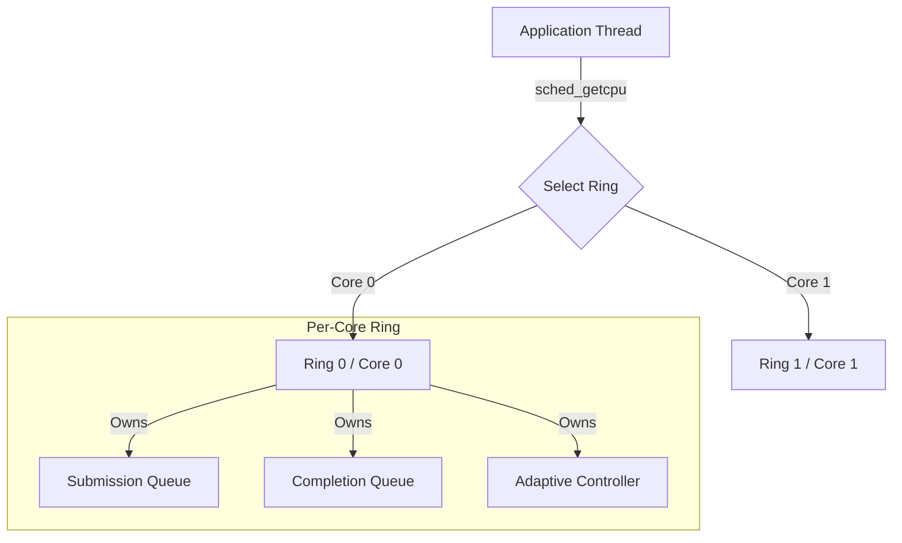

# AuraIO Architecture Guide

## System Overview

AuraIO is designed as a **thread-per-core** asynchronous I/O runtime. Unlike traditional reactor patterns that use a single event loop or a thread pool for callbacks, AuraIO dedicates an `io_uring` instance to each CPU core. This architecture minimizes cross-core traffic, maximizes cache locality, and eliminates the "thundering herd" problem common in high-concurrency network servers.

## Core Components

### 1. Engine (`auraio_engine_t`)
The high-level container that manages the lifecycle of the entire runtime.
- **Topology**: Automatically detects CPU core count (`sysconf(_SC_NPROCESSORS_ONLN)`) and creates a corresponding number of Rings.
- **Unified EventFD**: Maintains a single `eventfd` registered with *all* rings. This allows integration with external event loops (like `epoll` or `kqueue`); when any ring processes a completion, this file descriptor becomes readable.

### 2. Rings (`ring_ctx_t`)
A 1:1 mapping to a kernel `io_uring` submission/completion queue pair.
- **Placement**: Typically pinned or logically associated with a specific CPU core.
- **Locking**: Uses a fine-grained `pthread_mutex` for submission. While `io_uring` is lock-free, the library layer adds a lightweight lock to ensure thread safety when multiple application threads submit to the same core's ring.
- **Assignment Strategy**:
  1.  **Ideal**: Submission thread is already on Core N -> Use Ring N (`sched_getcpu()`).
  2.  **Fallback**: Thread has no stable core -> Sticky assignment to Ring `(thread_id % core_count)`.

### 3. Adaptive Controller (`adaptive_controller_t`)
A robust control system embedded within each ring that tunes `queue_depth` and batching behavior in real-time.
- **Goal**: Maximize throughput while maintaining latency within a defined P99 envelope (default 10ms).
- **Algorithm**: **AIMD (Additive Increase Multiplicative Decrease)**.
    - *Probing Phase*: Linearly increases in-flight limit (`+N` per tick) while throughput increases.
    - *Backoff Phase*: Multiplicatively reduces limit (`* 0.8`) if P99 latency violates strict guards.
    - *Steady State*: Holds configuration when throughput plateaus to avoid unnecessary oscillation.

### 4. Memory Pool (`buffer_pool_t`)
A zero-copy-ready slab allocator designed to reduce `malloc/free` overhead and ensure `O_DIRECT` alignment (4KB).
- **Layer 1: Thread-Local Cache**:
  - Lock-free stack of hot buffers.
  - Handles ~95% of allocation/free traffic.
- **Layer 2: Sharded Global Pool**:
  - Fallback when local cache is empty/full.
  - Sharded by `next_power_of_2(cpu_count / 4)` to reduce lock contention.

## Concurrency Model

AuraIO employs a **Shared-Nothing (mostly)** architecture.

### Submission Flow
1. Thread calls `auraio_read()`.
2. Library checks `sched_getcpu()`.
3. Acquires Mutex for that Core's Ring.
4. Pushes SQE (Submission Queue Entry).
5. Checks Adaptive Controller: "Should we flush now?" (Batching optimizer).
6. Releases Mutex.

### Completion Flow
1. User calls `auraio_poll()` or `auraio_wait()`.
2. Library peeks at Completion Queue (CQ).
3. If atomic ref-counts allow, reuses request slot immediately.
4. Invokes user callback.

## Design Decisions & Trade-offs

### Why manual locking on top of io_uring?
`io_uring` is thread-safe for single-producer/single-consumer. Since AuraIO allows *any* thread to submit to *any* core (for ergonomic simplicity), a mutex is required. The contention is mitigated by the fact that threads prioritize their local core's ring, naturally sharding the locking load.

### Why AIMD?
Static queue depths (e.g., `QD=128`) are often wrong.
- **Too low**: Hardware is idle.
- **Too high**: Bufferbloat occurs, latency spikes to hundreds of milliseconds.
AIMD finds the "Knee of the Curve" dynamically, adjusting to noisy neighbors or changing workload patterns without human intervention.
