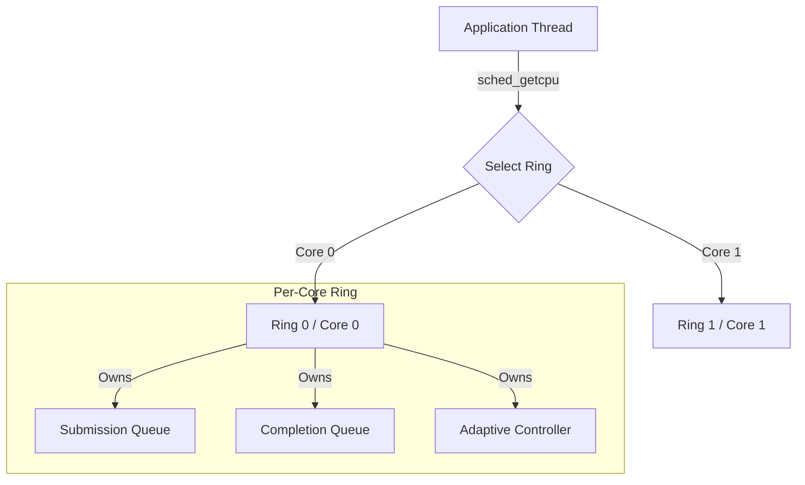

# AuraIO Architecture Guide
Adaptive Uring Runtime Architecture

## System Overview

AuraIO is designed as a **ring-per-core** asynchronous I/O runtime. Unlike traditional reactor patterns that use a single event loop or a thread pool for callbacks, AuraIO dedicates an `io_uring` instance to each CPU core and routes submissions to the local core's ring. This architecture minimizes cross-core traffic, maximizes cache locality, and eliminates the "thundering herd" problem common in high-concurrency network servers.

## Core Components

### 1. Engine (`auraio_engine_t`)
The high-level container that manages the lifecycle of the entire runtime.
- **Topology**: Automatically detects CPU core count (`sysconf(_SC_NPROCESSORS_ONLN)`) and creates a corresponding number of Rings.
- **Unified EventFD**: Maintains a single `eventfd` registered with *all* rings. This allows integration with external event loops (like `epoll` or `kqueue`); when any ring processes a completion, this file descriptor becomes readable.

### 2. Rings (`ring_ctx_t`)
A 1:1 mapping to a kernel `io_uring` submission/completion queue pair.
- **Placement**: Typically pinned or logically associated with a specific CPU core.
- **Locking**: Uses a fine-grained `pthread_mutex` for submission. While `io_uring` is lock-free, the library layer adds a lightweight lock to ensure thread safety when multiple application threads submit to the same core's ring.
- **Assignment Strategy**:
  1.  **Ideal**: Submission thread is on Core N -> Use Ring N (via TLS-cached `sched_getcpu()`, refreshed every 32 submissions).
  2.  **Fallback**: `sched_getcpu()` unavailable -> Sticky assignment to Ring `(pthread_self() % ring_count)`.

### 3. Adaptive Controller (`adaptive_controller_t`)
A robust control system embedded within each ring that tunes `queue_depth` and batching behavior in real-time.
- **Goal**: Maximize throughput while maintaining latency within a defined P99 envelope (default 10ms).
- **Algorithm**: **AIMD (Additive Increase Multiplicative Decrease)**.
    - *Probing Phase*: Linearly increases in-flight limit (`+N` per tick) while throughput increases.
    - *Backoff Phase*: Multiplicatively reduces limit (`* 0.8`) if P99 latency violates strict guards.
    - *Steady State*: Holds configuration when throughput plateaus to avoid unnecessary oscillation.

### 4. Memory Pool (`buffer_pool_t`)
A zero-copy-ready slab allocator designed to reduce `malloc/free` overhead and ensure `O_DIRECT` alignment (4KB).
- **Layer 1: Thread-Local Cache**:
  - Lock-free stack of hot buffers per size class.
  - Handles the majority of allocation/free traffic with zero lock contention.
- **Layer 2: Sharded Global Pool**:
  - Fallback when local cache is empty/full.
  - Sharded by `next_power_of_2(cpu_count / 4)` to reduce lock contention.

## Concurrency Model

AuraIO employs a **Shared-Nothing (mostly)** architecture.



### Submission Flow
1. Thread calls `auraio_read()`.
2. Library reads TLS-cached CPU ID (refreshed via `sched_getcpu()` every 32 submissions).
3. Acquires Mutex for that Core's Ring.
4. Pushes SQE (Submission Queue Entry).
5. Checks Adaptive Controller: "Should we flush now?" (Batching optimizer).
6. Releases Mutex.

### Completion Flow
1. User calls `auraio_poll()` or `auraio_wait()`.
2. Library drains Completion Queue (CQ) entries under the ring's completion lock.
3. For each CQE: invokes user callback, then returns the request slot to the free stack.
4. Adaptive controller records latency sample and updates throughput counters.

## Design Decisions & Trade-offs

### Why manual locking on top of io_uring?
`io_uring` is thread-safe for single-producer/single-consumer. Since AuraIO allows *any* thread to submit to *any* core (for ergonomic simplicity), a mutex is required. The contention is mitigated by the fact that threads prioritize their local core's ring, naturally sharding the locking load.

### Why AIMD?
Static queue depths (e.g., `QD=128`) are often wrong.
- **Too low**: Hardware is idle.
- **Too high**: Bufferbloat occurs, latency spikes to hundreds of milliseconds.
AIMD finds the "Knee of the Curve" dynamically, adjusting to noisy neighbors or changing workload patterns without human intervention.

## Adoption Guide

AuraIO is designed for **drop-in adoption** with minimal code changes. The library handles all the complexity of io_uring, adaptive tuning, and multi-core scheduling internally—your application just submits I/O and processes callbacks.

### Integration Points

```
┌─────────────────────────────────────────────────────────────┐
│                    Your Application                         │
├─────────────────────────────────────────────────────────────┤
│  Business Logic  │  Data Processing  │  Protocol Handling  │
├──────────────────┴───────────────────┴─────────────────────┤
│                      AuraIO API                             │
│         read() / write() / wait() / callbacks              │
├─────────────────────────────────────────────────────────────┤
│                   AuraIO Internals                          │
│  Ring Selection │ Adaptive Tuning │ Buffer Pools │ Batching│
├─────────────────────────────────────────────────────────────┤
│                     io_uring / Kernel                       │
└─────────────────────────────────────────────────────────────┘
```

Your code interacts only with the top API layer. Everything below—ring management, queue depth tuning, latency monitoring—is automatic.

### C API: Systems Programming & Infrastructure

The C API is ideal for databases, storage engines, proxies, and embedded systems where you need maximum control and zero abstraction overhead.

**Before (POSIX blocking I/O):**
```c
// Blocking read - thread stalls until complete
ssize_t n = pread(fd, buf, len, offset);
if (n < 0) handle_error(errno);
process_data(buf, n);
```

**After (AuraIO async I/O):**
```c
// Non-blocking submission - thread continues immediately
auraio_read(engine, fd, auraio_buf(buf), len, offset,
    my_callback, user_context);

// Later: process completions (can batch hundreds)
auraio_wait(engine, -1);

void my_callback(auraio_request_t *req, ssize_t n, void *ctx) {
    if (n < 0) handle_error(-n);
    process_data(/* ... */);
}
```

**Migration effort:** ~20 lines of boilerplate (engine create/destroy, callback wrapper), then mechanical transformation of each I/O call. No architectural changes required—you can adopt incrementally, one file at a time.

### C++ API: Application Development

The C++ bindings provide a modern, ergonomic interface with RAII, exceptions, lambdas, and coroutines. Ideal for services, data pipelines, and applications where developer productivity matters.

**Before (POSIX with error handling):**
```cpp
void read_file(int fd, std::vector<char>& buf) {
    ssize_t n = ::pread(fd, buf.data(), buf.size(), 0);
    if (n < 0) {
        throw std::system_error(errno, std::generic_category(), "read failed");
    }
    buf.resize(n);
}
```

**After (AuraIO with lambdas):**
```cpp
void read_file_async(auraio::Engine& engine, int fd, std::vector<char>& buf) {
    auto buffer = engine.allocate_buffer(buf.size());

    engine.read(fd, buffer, buf.size(), 0, [&](auto& req, ssize_t n) {
        if (n > 0) {
            std::memcpy(buf.data(), buffer.data(), n);
            buf.resize(n);
        }
    });

    engine.wait();
}
```

**After (AuraIO with coroutines - C++20):**
```cpp
auraio::Task<std::vector<char>> read_file_async(auraio::Engine& engine, int fd, size_t size) {
    auto buf = engine.allocate_buffer(size);
    ssize_t n = co_await engine.async_read(fd, buf, size, 0);
    co_return std::vector<char>(static_cast<char*>(buf.data()),
                                 static_cast<char*>(buf.data()) + n);
}
```

**Migration effort:** Add `#include <auraio.hpp>`, create an `Engine`, replace blocking calls with async equivalents. The C++ compiler catches type errors, and RAII handles cleanup automatically.

### Choosing C vs C++

| Consideration | C API | C++ API |
|---------------|-------|---------|
| **Use case** | Storage engines, databases, OS components, embedded | Services, applications, data pipelines |
| **Error handling** | Return codes + errno | Exceptions |
| **Memory management** | Manual (or use buffer pool) | RAII (automatic) |
| **Callback style** | Function pointers + void* | Lambdas with captures |
| **Async pattern** | Callbacks only | Callbacks or coroutines |
| **Dependencies** | libc, liburing | libc, liburing, C++20 stdlib |
| **Binary size** | Minimal | Moderate (templates) |

**Recommendation:**
- Building infrastructure that other code depends on? → **C API**
- Building an application or service? → **C++ API**
- Uncertain? Start with C++. You can always call the C API directly if needed—the C++ `Engine::handle()` method exposes the underlying `auraio_engine_t*`.

### Incremental Adoption Strategy

You don't need to convert your entire codebase at once:

1. **Week 1**: Identify I/O hot paths (profiling shows blocking in `read`/`write`/`fsync`)
2. **Week 2**: Create one shared `Engine` instance, convert hot paths to async
3. **Week 3**: Measure throughput/latency improvements, expand to more call sites
4. **Ongoing**: New code uses AuraIO by default; old code migrates opportunistically

The library is designed so that synchronous and asynchronous code can coexist—you can call `auraio_wait()` immediately after submission for synchronous-style semantics while still benefiting from io_uring's kernel efficiency.
